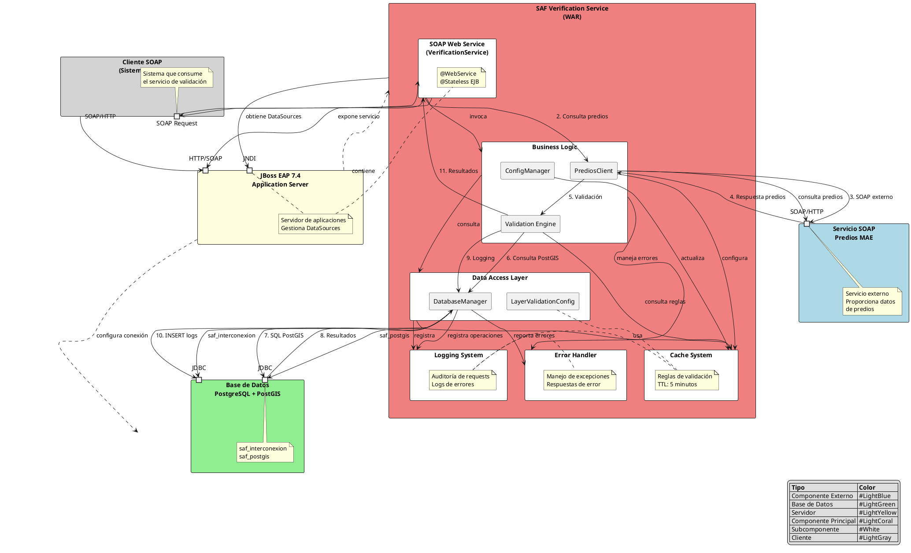

# Diagramas de Arquitectura - Sistema SAF Interconexión

## Fecha de Actualización
13 de enero de 2026

## 📋 Índice

1. [Diagrama de Clases](#diagrama-de-clases)
2. [Diagrama de Componentes](#diagrama-de-componentes)
3. [Leyenda y Notaciones](#leyenda-y-notaciones)

---

## 🏗️ Diagrama de Clases

```plantuml
@startuml Diagrama de Clases - SAF Verification Service

package "com.saf.verification" as SAF {

    ' === CLASES PRINCIPALES ===
    class VerificationService {
        -logsDS: DataSource
        -capasDS: DataSource
        -configManager: ConfigManager
        -prediosClient: PrediosClient
        -dbManager: DatabaseManager
        --
        +verifyPrediosByIdentifier(request): VerifyPrediosByIdentifierResponse
        -processPredio(predio, type, layers): PredioVerification
        -calculateIntersectionWithValidation(predio, rule): LayerResult
        -createSummary(verifications): Summary
    }

    class DatabaseManager {
        -logsDS: DataSource
        -capasDS: DataSource
        --
        +logRequest(request, response): void
        +logPredioDetails(requestId, verification): void
        +calculateIntersection(predioWkt, capaTabla): Map<String,Object>
        +getConfigValue(key): String
        +getValidationLayers(): List<LayerValidationRule>
        +getThresholdsBySize(layerId): List<ThresholdBySize>
    }

    class LayerValidationConfig {
        -VALIDATION_RULES_CACHE: Map<String,List<LayerValidationRule>>
        --
        +getRulesForType(validationType): List<LayerValidationRule>
        +loadRulesFromDatabase(): void
        -ensureCacheLoaded(): void
    }

    class PrediosClient {
        -serviceUrl: String
        -username: String
        -password: String
        --
        +getPredios(identifierType, identifierValue): GetPrediosResponse
    }

    ' === CLASES DE DATOS ===
    class VerifyPrediosByIdentifierRequest {
        -identifierType: String
        -identifierValue: String
        -verificationType: String
        -layersToCheck: List<String>
    }

    class VerifyPrediosByIdentifierResponse {
        -requestStatus: RequestStatus
        -identifierEcho: String
        -predioVerifications: List<PredioVerification>
        -summary: Summary
    }

    class PredioVerification {
        -predioId: String
        -predioCodigo: String
        -predioOwnerCedula: String
        -predioOwnerName: String
        -predioAreaM2: double
        -predioSRID: int
        -predioGeometryGeoJSON: String
        -layersResults: List<LayerResult>
    }

    class LayerResult {
        -layerId: String
        -layerName: String
        -wmsLayerName: String
        -intersects: boolean
        -intersectionAreaM2: double
        -percentage: double
        -intersectionGeoJSON: String
        -validationPassed: boolean
        -validationMessage: String
        -maxAllowedPercentage: Double
        -layerNotLoaded: boolean
    }

    class LayerValidationRule {
        -layerName: String
        -layerTableName: String
        -schemaName: String
        -validationType: String
        -maxIntersectionPercentage: Double
        -minIntersectionAreaM2: Double
        -validationMessage: String
        -layerVersion: String
        -isActive: boolean
        -zoneType: String
        -messageApproved: String
        -messageRejected: String
        -thresholds: List<ThresholdBySize>
    }

    class ThresholdBySize {
        -id: Integer
        -minHectares: Double
        -maxHectares: Double
        -maxPercentage: Double
        -description: String
    }

    ' === CLASES DE SOPORTE ===
    class RequestStatus {
        -code: String
        -type: String
        -message: String
    }

    class Summary {
        -totalPredios: int
        -prediosWithIntersections: int
        -totalLayersChecked: int
        -layersWithIntersections: int
        -validationPassed: boolean
        -validationMessage: String
    }

    class Predio {
        -predioId: String
        -predioCodigo: String
        -identifier: String
        -ownerName: String
        -areaM2: double
        -srid: int
        -geometryWKT: String
        -geometryGeoJSON: String
    }

    class ConfigManager {
        -configCache: Map<String,String>
        --
        +getConfigValue(key): String
        +refreshCache(): void
    }

    ' === CLASES DE INTEGRACIÓN ===
    class GetPrediosRequest {
        -identifierType: String
        -identifierValue: String
    }

    class GetPrediosResponse {
        -predios: List<Predio>
        -status: String
        -message: String
    }

    ' === RELACIONES ===
    VerificationService --> DatabaseManager : usa
    VerificationService --> LayerValidationConfig : consulta
    VerificationService --> PrediosClient : invoca
    VerificationService --> ConfigManager : configura

    VerificationService ..> VerifyPrediosByIdentifierRequest : recibe
    VerificationService ..> VerifyPrediosByIdentifierResponse : retorna

    VerifyPrediosByIdentifierResponse --> RequestStatus : contiene
    VerifyPrediosByIdentifierResponse --> Summary : contiene
    VerifyPrediosByIdentifierResponse --> PredioVerification : contiene

    PredioVerification --> LayerResult : contiene

    LayerValidationRule --> ThresholdBySize : contiene

    DatabaseManager --> LayerValidationRule : carga
    DatabaseManager --> ThresholdBySize : carga

    PrediosClient ..> GetPrediosRequest : envía
    PrediosClient ..> GetPrediosResponse : recibe

    GetPrediosResponse --> Predio : contiene

    ' === NOTAS ===
    note right of VerificationService : Servicio Web SOAP Principal\n@Stateless EJB\n@WebService
    note right of DatabaseManager : Gestiona conexiones JDBC\nPostGIS y Logging
    note right of LayerValidationConfig : Cache de reglas de validación\nTTL: 5 minutos
    note right of PrediosClient : Cliente SOAP externo\nServicio de Predios
}

' === INTERFACES EXTERNAS ===
interface "Servicio SOAP\nPredios" as PrediosSOAP
interface "Base de Datos\nPostgreSQL/PostGIS" as PostGIS
interface "JBoss EAP 7.4" as JBoss

VerificationService ..> PrediosSOAP : SOAP/HTTP
DatabaseManager ..> PostGIS : JDBC
VerificationService ..> JBoss : JNDI DataSource

@enduml
```



---

## 🏛️ Diagrama de Componentes



---

## 📖 Leyenda y Notaciones

### Notaciones UML

| Símbolo | Significado |
|---------|-------------|
| 📦 **Package** | Agrupación lógica de clases |
| 🔵 **Class** | Clase con atributos y métodos |
| 🔗 **Association** | Relación entre clases |
| 🔺 **Inheritance** | Herencia de clases |
| 🔶 **Interface** | Contrato de métodos |
| 📝 **Note** | Información adicional |

### Convenciones de Nombres

| Prefijo | Significado |
|---------|-------------|
| `*Request` | Clases de entrada SOAP |
| `*Response` | Clases de salida SOAP |
| `*Result` | Resultados de operaciones |
| `*Validation*` | Reglas y lógica de validación |
| `*Manager` | Gestores de recursos |
| `*Client` | Clientes de servicios externos |

### Patrones de Diseño Identificados

1. **Facade Pattern**: `VerificationService` como interfaz simplificada
2. **DAO Pattern**: `DatabaseManager` para acceso a datos
3. **Factory Pattern**: Creación de reglas de validación
4. **Cache Pattern**: `LayerValidationConfig` con TTL
5. **Observer Pattern**: Logging de operaciones
6. **Strategy Pattern**: Diferentes tipos de validación

### Tecnologías Representadas

- **Java EE**: EJB, JAX-WS, CDI
- **JBoss EAP**: Application Server
- **PostgreSQL/PostGIS**: Base de datos espacial
- **SOAP**: Protocolo de comunicación
- **JDBC**: Acceso a base de datos
- **Maven**: Gestión de dependencias

---

## 🔧 Generación de Diagramas

### Herramientas Recomendadas

1. **PlantUML**: Plugin para VS Code o IntelliJ
2. **Draw.io**: Importar desde PlantUML
3. **IntelliJ IDEA**: Plugin de diagramas UML
4. **Eclipse**: Plugin Papyrus

### Comandos para Generar Imágenes

```bash
# Ejecutar script automático (recomendado)
./generar_diagramas.sh

# O generar manualmente con PlantUML
plantuml diagrama_clases.puml
plantuml diagrama_componentes.puml

# Generar en formato SVG (vectorial)
plantuml -tsvg diagrama_clases.puml
plantuml -tsvg diagrama_componentes.puml
```

### Requisitos para Generar Diagramas

```bash
# Instalar PlantUML en Ubuntu/Debian
sudo apt update && sudo apt install plantuml

# Verificar instalación
plantuml -version
```

### Archivos Generados

Después de ejecutar el script, se crearán:
- `diagrama_clases.png` - Diagrama de clases en formato PNG
- `diagrama_componentes.png` - Diagrama de componentes en formato PNG
- `diagrama_clases.svg` - Diagrama de clases en formato SVG (opcional)
- `diagrama_componentes.svg` - Diagrama de componentes en formato SVG (opcional)

### Archivos Fuente

Los diagramas están definidos en formato PlantUML y pueden ser:
- Editados directamente en el código
- Convertidos a imágenes PNG/SVG
- Integrados en documentación
- Versionados en Git

---

## 📞 Soporte

Para soporte técnico, consultar:
- `MANUAL_PROGRAMADOR.md`: Detalles de implementación
- `MANUAL_INSTALACION.md`: Guía de instalación
- `DICCIONARIO_DATOS_SAF.md`: Especificaciones de datos</content>
<parameter name="filePath">/home/linkmaedev/Proyecto_Interconeccion/SAF_Services/Documentos/DIAGRAMAS_ARQUITECTURA.md