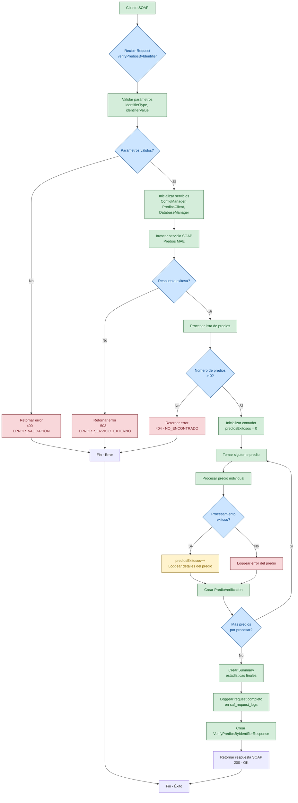
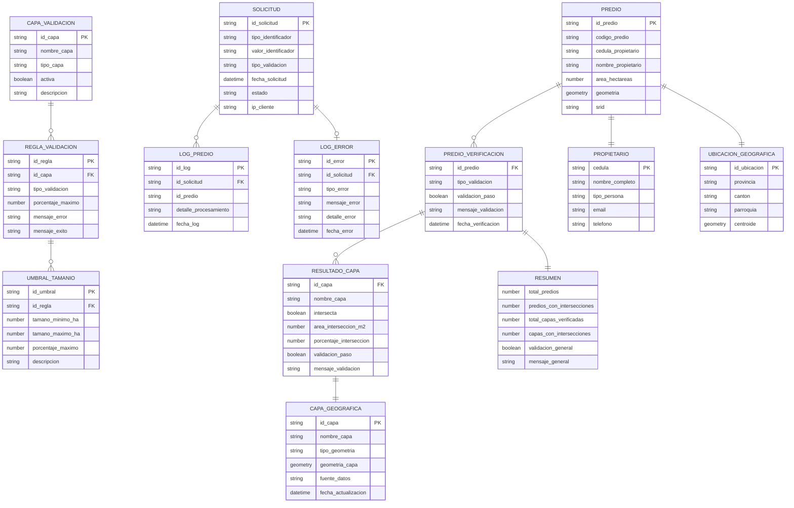
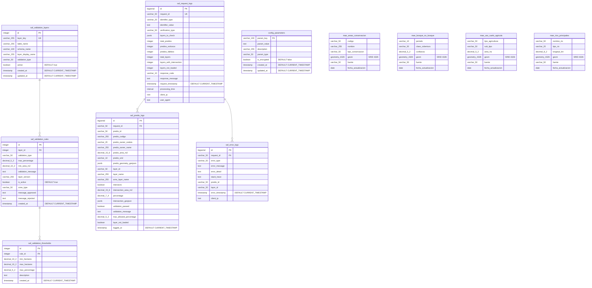
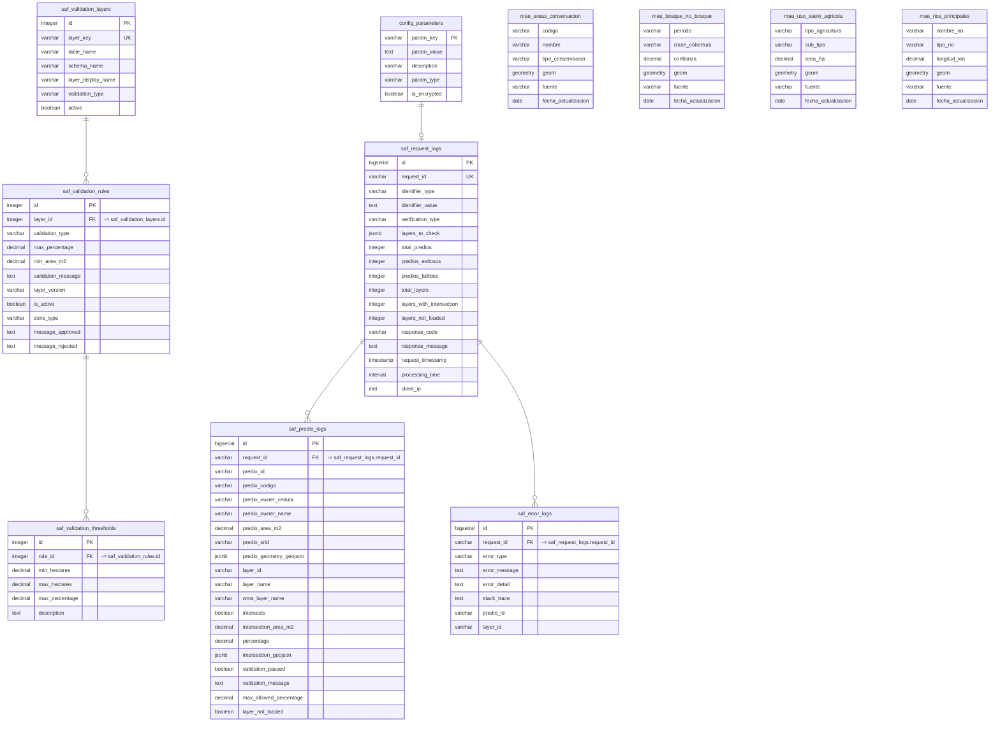
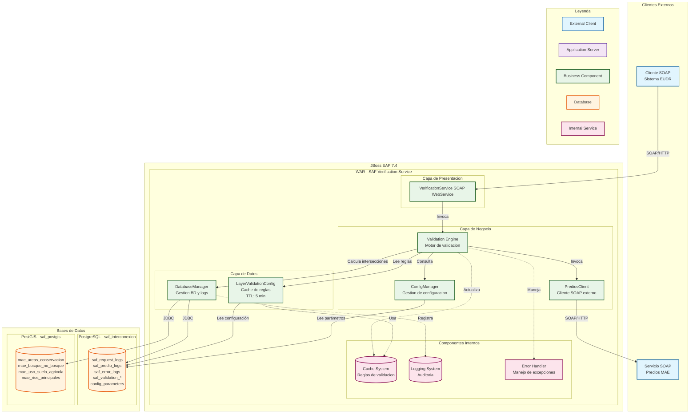

# Diagramas Mermaid - Sistema SAF Interconexión

## Fecha de Actualización
13 de enero de 2026

## 📋 Índice

1. [Diagrama de Flujo](#diagrama-de-flujo)
2. [Modelo Lógico de Datos](#modelo-lógico-de-datos)
3. [Modelo Físico de Datos](#modelo-físico-de-datos)
4. [Modelo Relacional de Datos](#modelo-relacional-de-datos)
5. [Diagrama de Componentes](#diagrama-de-componentes)
6. [Diagrama de Clases](#diagrama-de-clases)
7. [Generación de Imágenes](#generación-de-imágenes)

---

## 🔄 Diagrama de Flujo



---

## 🏗️ Modelo Lógico de Datos



---

## 🗄️ Modelo Físico de Datos



---

## 🔗 Modelo Relacional de Datos



---

## 🏛️ Diagrama de Componentes



---

## 🏗️ Diagrama de Clases

```mermaid
classDiagram
    %% Clases principales del servicio
    class VerificationService {
        +DataSource logsDS
        +DataSource capasDS
        -ConfigManager configManager
        -PrediosClient prediosClient
        -DatabaseManager dbManager
        --
        +verifyPrediosByIdentifier(request): VerifyPrediosByIdentifierResponse
        -processPredio(predio, type, layers): PredioVerification
        -calculateIntersectionWithValidation(predio, rule): LayerResult
        -createSummary(verifications): Summary
        -initializeIfNeeded(): void
        -generateRequestId(): String
        -logErrorSafe(requestId, type, exception): void
    }

    class DatabaseManager {
        -DataSource logsDS
        -DataSource capasDS
        --
        +logRequest(request, response): void
        +logPredioDetails(requestId, verification): void
        +calculateIntersection(predioWkt, capaTabla): Map~String,Object~
        +getConfigValue(key): String
        +getValidationLayers(): List~LayerValidationRule~
        +getThresholdsBySize(layerId): List~ThresholdBySize~
        -closeQuietly(...): void
    }

    class LayerValidationConfig {
        -Map~String,List~LayerValidationRule~~ VALIDATION_RULES_CACHE
        -long lastCacheRefresh
        --
        +getRulesForType(validationType): List~LayerValidationRule~
        +loadRulesFromDatabase(): void
        -ensureCacheLoaded(): void
        -getJDBCConnection(): Connection
    }

    class PrediosClient {
        -String serviceUrl
        -String username
        -String password
        --
        +getPredios(identifierType, identifierValue): GetPrediosResponse
        -createSOAPClient(): Object
    }

    %% Clases de datos SOAP
    class VerifyPrediosByIdentifierRequest {
        -String identifierType
        -String identifierValue
        -String verificationType
        -List~String~ layersToCheck
        --
        +getters/setters
    }

    class VerifyPrediosByIdentifierResponse {
        -RequestStatus requestStatus
        -String identifierEcho
        -List~PredioVerification~ predioVerifications
        -Summary summary
        --
        +getters/setters
    }

    class PredioVerification {
        -String predioId
        -String predioCodigo
        -String predioOwnerCedula
        -String predioOwnerName
        -double predioAreaM2
        -int predioSRID
        -String predioGeometryGeoJSON
        -List~LayerResult~ layersResults
        --
        +getters/setters
    }

    class LayerResult {
        -String layerId
        -String layerName
        -String wmsLayerName
        -boolean intersects
        -double intersectionAreaM2
        -double percentage
        -String intersectionGeoJSON
        -boolean validationPassed
        -String validationMessage
        -Double maxAllowedPercentage
        -boolean layerNotLoaded
        --
        +getters/setters
    }

    %% Clases de configuración
    class LayerValidationRule {
        -String layerName
        -String layerTableName
        -String schemaName
        -String validationType
        -Double maxIntersectionPercentage
        -Double minIntersectionAreaM2
        -String validationMessage
        -String layerVersion
        -boolean isActive
        -String zoneType
        -String messageApproved
        -String messageRejected
        -List~ThresholdBySize~ thresholds
        --
        +getters/setters
        +isActive(): boolean
    }

    class ThresholdBySize {
        -Integer id
        -Double minHectares
        -Double maxHectares
        -Double maxPercentage
        -String description
        --
        +getters/setters
    }

    %% Clases de soporte
    class RequestStatus {
        -String code
        -String type
        -String message
        --
        +getters/setters
    }

    class Summary {
        -int totalPredios
        -int prediosWithIntersections
        -int totalLayersChecked
        -int layersWithIntersections
        -boolean validationPassed
        -String validationMessage
        --
        +getters/setters
    }

    class Predio {
        -String predioId
        -String predioCodigo
        -String identifier
        -String ownerName
        -double areaM2
        -int srid
        -String geometryWKT
        -String geometryGeoJSON
        --
        +getters/setters
    }

    class ConfigManager {
        -Map~String,String~ configCache
        --
        +getConfigValue(key): String
        +refreshCache(): void
    }

    %% Clases de integración
    class GetPrediosRequest {
        -String identifierType
        -String identifierValue
        --
        +getters/setters
    }

    class GetPrediosResponse {
        -List~Predio~ predios
        -String status
        -String message
        --
        +getters/setters
    }

    %% Relaciones de composición
    VerifyPrediosByIdentifierResponse *-- RequestStatus
    VerifyPrediosByIdentifierResponse *-- Summary
    VerifyPrediosByIdentifierResponse *-- PredioVerification
    PredioVerification *-- LayerResult
    LayerValidationRule *-- ThresholdBySize
    GetPrediosResponse *-- Predio

    %% Relaciones de asociación
    VerificationService --> DatabaseManager : usa
    VerificationService --> LayerValidationConfig : consulta
    VerificationService --> PrediosClient : invoca
    VerificationService --> ConfigManager : configura

    VerificationService ..> VerifyPrediosByIdentifierRequest : recibe
    VerificationService ..> VerifyPrediosByIdentifierResponse : retorna

    DatabaseManager --> LayerValidationRule : carga
    DatabaseManager --> ThresholdBySize : carga

    PrediosClient ..> GetPrediosRequest : envía
    PrediosClient ..> GetPrediosResponse : recibe

    %% Interfaces externas
    VerificationService ..|> WebService : implements
    VerificationService ..|> Stateless : implements
```



---

## 🖼️ Generación de Imágenes

### Archivos Mermaid (.mmd)

Los diagramas están disponibles en archivos separados:
- `diagrama_flujo.mmd` - Diagrama de flujo del proceso
- `modelo_logico_datos.mmd` - Modelo lógico de datos
- `modelo_fisico_datos.mmd` - Modelo físico de datos
- `modelo_relacional_datos.mmd` - Modelo relacional con cardinalidad
- `diagrama_componentes.mmd` - Arquitectura de componentes
- `diagrama_clases.mmd` - Diagrama de clases

### Generación Automática

```bash
# Usando Mermaid CLI (si está instalado)
npm install -g @mermaid-js/mermaid-cli
mmdc -i diagrama_flujo.mmd -o diagrama_flujo.png
mmdc -i diagrama_clases.mmd -o diagrama_clases.png

# Para todos los diagramas
for file in *.mmd; do
    mmdc -i "$file" -o "${file%.mmd}.png"
done
```

### Visualización Online

Los archivos `.mmd` pueden visualizarse en:
- [Mermaid Live Editor](https://mermaid.live)
- GitHub (renderiza automáticamente)
- VS Code con extensión Mermaid
- Draw.io con importación Mermaid

### Integración en Documentación

Los diagramas Mermaid se pueden integrar directamente en:
- Archivos Markdown (como este documento)
- Documentación Sphinx
- Sitios web con soporte Mermaid
- Wikis corporativos

---

## 📞 Soporte

Para soporte técnico, consultar:
- `MANUAL_PROGRAMADOR.md`: Detalles de implementación
- `MANUAL_INSTALACION.md`: Guía de instalación
- `DICCIONARIO_DATOS_SAF.md`: Especificaciones de datos