# 🔧 Manual de Operación y Mantenimiento - SAF Verification Service

**Versión:** 1.0.0  
**Fecha:** 20 de enero de 2026  
**Sistema:** SAF Verification Service  
**Ministerio del Ambiente, Agua y Transición Ecológica (MAATE)**

---

## 📑 Tabla de Contenidos

1. [Introducción](#introducción)
2. [Arquitectura del Sistema](#arquitectura-del-sistema)
3. [Flujos de Operación](#flujos-de-operación)
4. [Procedimientos de Operación](#procedimientos-de-operación)
5. [Monitoreo del Sistema](#monitoreo-del-sistema)
6. [Mantenimiento Preventivo](#mantenimiento-preventivo)
7. [Mantenimiento Correctivo](#mantenimiento-correctivo)
8. [Gestión de Configuraciones](#gestión-de-configuraciones)
9. [Respaldo y Recuperación](#respaldo-y-recuperación)
10. [Troubleshooting](#troubleshooting)
11. [Escalamiento y Tunning](#escalamiento-y-tunning)
12. [Seguridad Operativa](#seguridad-operativa)
13. [Checklist de Operación](#checklist-de-operación)
14. [Contactos y Escalamiento](#contactos-y-escalamiento)

---

## 🎯 Introducción

### Propósito del Manual

Este manual proporciona procedimientos detallados para la operación y mantenimiento del **SAF Verification Service**, cubriendo:
- Operación diaria del sistema
- Monitoreo de salud y rendimiento
- Mantenimiento preventivo y correctivo
- Resolución de problemas comunes
- Gestión de configuraciones
- Procedimientos de respaldo y recuperación

### Audiencia

- **Operadores de Sistemas**: Personal de primera línea
- **Administradores de Aplicaciones**: Soporte nivel 2
- **DBAs**: Administradores de bases de datos
- **Ingenieros DevOps**: Automatización y despliegue

### Alcance

El manual cubre la operación del servicio SOAP desplegado en JBoss EAP 7.4 con bases de datos PostgreSQL/PostGIS.

---

## 🏗️ Arquitectura del Sistema

### Diagrama de Componentes

```
┌─────────────────────────────────────────────────────────────────┐
│                        CLIENTE SOAP                              │
│              (Sistemas Externos de Licencias/Permisos)           │
└────────────────────────────┬────────────────────────────────────┘
                             │ HTTP/SOAP
                             ▼
┌─────────────────────────────────────────────────────────────────┐
│                      JBOSS EAP 7.4                               │
│  ┌──────────────────────────────────────────────────────────┐   │
│  │  VerificationService.war                                  │   │
│  │  ┌─────────────────┐  ┌─────────────────┐               │   │
│  │  │VerificationSvc  │  │ DatabaseManager │               │   │
│  │  │  @WebService    │──│   (Logs & DB)   │               │   │
│  │  │  @Stateless     │  └────────┬────────┘               │   │
│  │  └────────┬────────┘           │                         │   │
│  │           │                     │                         │   │
│  │           │  ┌──────────────────┴──────────────┐         │   │
│  │           ├──│ LayerValidationConfig           │         │   │
│  │           │  │ (Cache 5 min, reglas dinámicas) │         │   │
│  │           │  └─────────────────────────────────┘         │   │
│  │           │                                               │   │
│  │           │  ┌─────────────────┐                         │   │
│  │           └──│ PrediosClient   │                         │   │
│  │              │  (SOAP externo) │                         │   │
│  │              └────────┬────────┘                         │   │
│  └───────────────────────┼──────────────────────────────────┘   │
│                          │                                       │
│  ┌───────────────────────┼──────────────────────────────────┐   │
│  │       DataSources     │                                   │   │
│  │  ┌───────────────┐    │    ┌────────────────┐           │   │
│  │  │ SAFLogsDS     │    │    │ SAFCapasDS     │           │   │
│  │  │ (JNDI inject) │    │    │ (JNDI inject)  │           │   │
│  │  └───────┬───────┘    │    └───────┬────────┘           │   │
│  └──────────┼────────────┼────────────┼────────────────────┘   │
└─────────────┼────────────┼────────────┼────────────────────────┘
              │            │            │
              ▼            │            ▼
    ┌──────────────────┐   │   ┌──────────────────┐
    │  PostgreSQL      │   │   │  PostgreSQL      │
    │  saf_interconexion│  │   │  saf_postgis     │
    │  ┌─────────────┐ │   │   │  ┌─────────────┐│
    │  │ saf_request │ │   │   │  │ mae_bosques ││
    │  │ _logs       │ │   │   │  │ .bosques_   ││
    │  ├─────────────┤ │   │   │  │ protectores ││
    │  │ saf_predio  │ │   │   │  ├─────────────┤│
    │  │ _logs       │ │   │   │  │ vegetacion_ ││
    │  ├─────────────┤ │   │   │  │ protectora  ││
    │  │ saf_error   │ │   │   │  └─────────────┘│
    │  │ _logs       │ │   │   │  (PostGIS 3.x)  │
    │  ├─────────────┤ │   │   └──────────────────┘
    │  │ config_     │ │   │
    │  │ parameters  │ │   │
    │  ├─────────────┤ │   │
    │  │ saf_        │ │   │
    │  │ validation_ │ │   │
    │  │ layers      │ │   │
    │  └─────────────┘ │   │
    └──────────────────┘   │
                           │
                           ▼
              ┌────────────────────────┐
              │ Servicio MAE Predios   │
              │ (SOAP Externo)         │
              │ http://predios-server/ │
              └────────────────────────┘
```

### Stack Tecnológico

| Componente | Tecnología | Versión | Puerto | Propósito |
|------------|------------|---------|--------|-----------|
| Servidor de Aplicaciones | JBoss EAP | 7.4.0 | 8580 (HTTP), 8443 (HTTPS) | Contenedor Java EE |
| Consola Admin | JBoss Admin | - | 9990 | Gestión y monitoreo |
| Web Service | JAX-WS | 2.3 | - | Endpoint SOAP |
| EJB Container | EJB 3.2 | - | - | Stateless beans |
| BD Logs | PostgreSQL | 12+ | 5432 | Logs y configuración |
| BD Capas | PostgreSQL/PostGIS | 12+/3.x | 5432 | Capas geográficas |
| Build Tool | Maven | 3.6+ | - | Compilación |
| Java Runtime | OpenJDK | 11 | - | Ejecución |

### Flujo de Datos

```
1. Cliente → Request SOAP → JBoss → VerificationService
2. VerificationService → Validación parámetros
3. VerificationService → DatabaseManager.getConfigValue() → saf_interconexion
4. VerificationService → PrediosClient.getPredios() → Servicio MAE
5. VerificationService → LayerValidationConfig.getRules() → saf_interconexion (cache 5 min)
6. VerificationService → DatabaseManager.calculateIntersection() → PostGIS
7. VerificationService → DatabaseManager.logRequest() → saf_interconexion
8. VerificationService → Response SOAP → Cliente
```

---

## 🔄 Flujos de Operación

### Flujo 1: Inicio del Sistema

```mermaid
flowchart TB
    A[Inicio] --> B[Systemctl start jboss]
    B --> C{JBoss arranca?}
    C -->|No| D[Revisar logs<br/>journalctl -u jboss]
    D --> E[Corregir error]
    E --> B
    C -->|Sí| F[Cargar standalone.xml]
    F --> G[Inicializar DataSources]
    G --> H{DataSources OK?}
    H -->|No| I[Error conexión BD]
    I --> J[Verificar PostgreSQL]
    J --> K[Verificar credenciales]
    K --> G
    H -->|Sí| L[Escanear deployments/]
    L --> M{WAR encontrado?}
    M -->|No| N[Fin - Sin aplicaciones]
    M -->|Sí| O[Desplegar WAR]
    O --> P[Inicializar Weld CDI]
    P --> Q[Inicializar EJB Container]
    Q --> R[Registrar WebService]
    R --> S[Publicar WSDL]
    S --> T{Despliegue exitoso?}
    T -->|No| U[Ver server.log]
    U --> V[Corregir error]
    V --> O
    T -->|Sí| W[Sistema LISTO]
    W --> Z[Fin]
```



**Tiempo estimado:** 15-30 segundos

---

### Flujo 2: Procesamiento de Solicitud SOAP

```mermaid
flowchart TB
    A[Cliente envía Request SOAP] --> B[JBoss recibe en puerto 8580]
    B --> C[Dispatcher JAX-WS]
    C --> D[VerificationService<br/>@WebMethod<br/>verifyPrediosByIdentifier]
    
    D --> E[Generar requestId UUID]
    E --> F{Validar parámetros}
    F -->|Inválido| G[Return 400 ERROR_VALIDACION]
    F -->|Válido| H[initializeIfNeeded]
    
    H --> I{Servicios<br/>inicializados?}
    I -->|No| J[Crear DatabaseManager<br/>logsDS + capasDS]
    J --> K[Leer config_parameters<br/>predios_service_url/usuario/clave]
    K --> L[Crear PrediosClient]
    L --> M[Servicios listos]
    I -->|Sí| M
    
    M --> N[PrediosClient.getPredios<br/>identifierType, identifierValue]
    N --> O{Servicio MAE<br/>responde?}
    O -->|No| P[Return 503<br/>ERROR_SERVICIO_EXTERNO]
    O -->|Sí| Q{Predios<br/>encontrados?}
    Q -->|No| R[Return 404<br/>NO_ENCONTRADO]
    Q -->|Sí| S[Iterar predios]
    
    S --> T[processPredio]
    T --> U[LayerValidationConfig<br/>.getRulesForType<br/>verificationType]
    U --> V{Cache vigente?}
    V -->|No| W[SELECT * FROM<br/>saf_validation_layers<br/>WHERE is_active=true]
    W --> X[Guardar en cache 5 min]
    X --> Y[Retornar reglas]
    V -->|Sí| Y
    
    Y --> Z[Filtrar capas<br/>si layersToCheck especificado]
    Z --> AA[Iterar reglas de validación]
    
    AA --> AB[calculateIntersectionWithValidation<br/>predio, rule]
    AB --> AC[DatabaseManager<br/>.calculateIntersection<br/>predioWKT, schemaTabla]
    
    AC --> AD[Query PostGIS:<br/>ST_Intersects<br/>ST_Intersection<br/>ST_Area<br/>ST_AsGeoJSON]
    AD --> AE{Query<br/>exitosa?}
    AE -->|No| AF[Marcar layerNotLoaded=true]
    AE -->|Sí| AG[Extraer resultados]
    
    AG --> AH[Calcular percentage<br/>área_intersección/área_predio*100]
    AH --> AI{Percentage ><br/>maxAllowed?}
    AI -->|Sí| AJ[validationPassed=false<br/>mensaje rechazo]
    AI -->|No| AK[validationPassed=true<br/>mensaje aprobado]
    
    AF --> AL[Agregar LayerResult]
    AJ --> AL
    AK --> AL
    
    AL --> AM{Más<br/>capas?}
    AM -->|Sí| AA
    AM -->|No| AN[Crear PredioVerification]
    
    AN --> AO[dbManager.logPredioDetails<br/>INSERT saf_predio_logs]
    AO --> AP{Más<br/>predios?}
    AP -->|Sí| T
    AP -->|No| AQ[createSummary<br/>totalPredios, with/without intersection]
    
    AQ --> AR[dbManager.logRequest<br/>INSERT saf_request_logs]
    AR --> AS[Crear VerifyPrediosByIdentifierResponse]
    AS --> AT[Return SUCCESS]
    
    G --> AZ[Fin]
    P --> AZ
    R --> AZ
    AT --> AZ
```

**Tiempo promedio:** 2-5 segundos por solicitud

---

### Flujo 3: Gestión de Caché de Reglas

```mermaid
flowchart TB
    A[Solicitud requiere reglas] --> B[LayerValidationConfig<br/>.getRulesForType]
    B --> C{VALIDATION_RULES_CACHE<br/>existe?}
    C -->|No| D[Primera carga]
    C -->|Sí| E{Cache expiró?<br/>now - lastRefresh > 5 min}
    
    D --> F[loadRulesFromDatabase]
    E -->|Sí| F
    E -->|No| G[Retornar cache]
    
    F --> H[getJDBCConnection<br/>saf_interconexion]
    H --> I[SELECT layer_key, layer_name,<br/>layer_table_name, validation_type,<br/>max_intersection_percentage,<br/>...<br/>FROM saf_validation_layers<br/>WHERE is_active = true]
    
    I --> J{Query<br/>exitosa?}
    J -->|No| K[Log ERROR<br/>Retornar cache anterior o vacío]
    J -->|Sí| L[Iterar ResultSet]
    
    L --> M[Crear LayerValidationRule<br/>por cada fila]
    M --> N{Tiene<br/>thresholds?}
    N -->|Sí| O[SELECT * FROM<br/>saf_thresholds_by_size<br/>WHERE layer_id = ?]
    O --> P[Agregar ThresholdBySize<br/>a la regla]
    N -->|No| Q[Sin umbrales escalonados]
    
    P --> R[Agrupar por<br/>validation_type]
    Q --> R
    R --> S[Actualizar<br/>VALIDATION_RULES_CACHE]
    S --> T[Actualizar<br/>lastCacheRefresh = now]
    T --> U[Retornar reglas]
    
    K --> Z[Fin]
    G --> Z
    U --> Z
```



**Frecuencia de actualización:** Cada 5 minutos

---

### Flujo 4: Cálculo de Intersección PostGIS

```mermaid
flowchart TB
    A[calculateIntersection<br/>predioWKT, capaSchemaTabla] --> B[Construir query SQL]
    
    B --> C[Query:<br/>SELECT<br/>  CASE WHEN ST_Area > 0 THEN true<br/>  ST_Area ST_Transform geography<br/>  ST_AsGeoJSON<br/>FROM<br/>  SELECT ST_Union ST_Intersection<br/>  FROM schema.tabla<br/>  WHERE ST_Intersects]
    
    C --> D[capasDS.getConnection]
    D --> E[prepareStatement]
    E --> F[setString 1, predioWKT]
    F --> G[setString 2, predioWKT]
    G --> H[executeQuery]
    
    H --> I{Excepción?}
    I -->|Sí| J{Tabla no<br/>existe?}
    J -->|Sí| K[Return Map<br/>table_not_found: true<br/>intersects: false<br/>area_m2: 0]
    J -->|No| L[Log ERROR<br/>Return null]
    
    I -->|No| M[ResultSet.next]
    M --> N{Tiene<br/>resultados?}
    N -->|No| O[Return null]
    N -->|Sí| P[Extraer datos]
    
    P --> Q[Map.put intersects<br/>rs.getBoolean]
    Q --> R[Map.put area_m2<br/>rs.getDouble]
    R --> S[Map.put geojson<br/>rs.getString]
    S --> T[Return Map]
    
    K --> Z[Fin]
    L --> Z
    O --> Z
    T --> Z
```



**Tiempo promedio:** 0.5-2 segundos por capa

---

### Flujo 5: Logging de Auditoría

```mermaid
flowchart TB
    A[Finaliza procesamiento] --> B[dbManager.logRequest<br/>request, response]
    
    B --> C[Calcular métricas<br/>totalPredios<br/>totalLayers<br/>layersNotLoaded<br/>layersWithIntersection]
    
    C --> D[logsDS.getConnection]
    D --> E[INSERT INTO saf_request_logs<br/>request_id, identifier_type,<br/>identifier_value, status_code,<br/>total_predios, total_layers_checked,<br/>layers_with_intersection,<br/>response_timestamp]
    
    E --> F{INSERT<br/>exitoso?}
    F -->|No| G[Log SEVERE<br/>No interrumpir flujo]
    F -->|Sí| H[commit]
    
    H --> I[Iterar predioVerifications]
    I --> J[dbManager.logPredioDetails<br/>requestId, verification]
    
    J --> K[Iterar layersResults]
    K --> L[Agregar batch<br/>INSERT INTO saf_predio_logs<br/>request_id, predio_id,<br/>predio_codigo, layer_name,<br/>intersects, intersection_area_m2,<br/>percentage, validation_passed]
    
    L --> M{Más<br/>layers?}
    M -->|Sí| K
    M -->|No| N[executeBatch]
    
    N --> O{Batch<br/>exitoso?}
    O -->|No| P[Log SEVERE]
    O -->|Sí| Q[commit]
    
    Q --> R{Más<br/>predios?}
    R -->|Sí| I
    R -->|No| S[Log INFO<br/>Request logged successfully]
    
    G --> Z[Fin]
    P --> Z
    S --> Z
```



**Nota:** Los errores de logging NO interrumpen el flujo principal.

---

### Flujo 6: Manejo de Errores

```mermaid
flowchart TB
    A[Excepción capturada] --> B{Tipo de<br/>excepción?}
    
    B -->|ValidationException| C[Código 400<br/>ERROR_VALIDACION]
    B -->|ServiceException| D[Código 503<br/>ERROR_SERVICIO_EXTERNO]
    B -->|SQLException| E[Código 500<br/>CONNECTION_ERROR]
    B -->|SpatialException| F[Código 500<br/>SPATIAL_ERROR]
    B -->|Other| G[Código 500<br/>INTERNAL_ERROR]
    
    C --> H[logErrorSafe<br/>requestId, errorType, exception]
    D --> H
    E --> H
    F --> H
    G --> H
    
    H --> I{dbManager<br/>disponible?}
    I -->|No| J[Log solo a<br/>System.err]
    I -->|Sí| K[dbManager.logError]
    
    K --> L[INSERT INTO saf_error_logs<br/>request_id, error_type,<br/>error_message, stack_trace,<br/>timestamp]
    
    L --> M{INSERT<br/>exitoso?}
    M -->|No| N[Log SEVERE<br/>Unable to log error]
    M -->|Sí| O[Log INFO<br/>Error logged]
    
    J --> P[Crear RequestStatus<br/>code, errorType, message]
    N --> P
    O --> P
    
    P --> Q[Retornar Response<br/>con error]
    Q --> Z[Fin]
```



---

## 🛠️ Procedimientos de Operación

### Procedimiento 1: Inicio del Sistema

**Responsable:** Operador de Sistemas  
**Frecuencia:** Diaria o después de mantenimiento  
**Duración:** 2-3 minutos

#### Pasos

1. **Verificar PostgreSQL activo**
   ```bash
   sudo systemctl status postgresql
   # Debe mostrar: active (running)
   ```

2. **Verificar conectividad a BD**
   ```bash
   psql -h localhost -U saf_app -d saf_interconexion -c "SELECT 1"
   psql -h localhost -U saf_app -d saf_postgis -c "SELECT 1"
   # Ambos deben retornar: 1
   ```

3. **Iniciar JBoss EAP**
   ```bash
   sudo systemctl start jboss
   ```

4. **Monitorear inicio**
   ```bash
   sudo journalctl -u jboss -f
   # Esperar mensaje: "WFLYSRV0025: JBoss EAP 7.4.0.GA ... started in XXXXms"
   ```

5. **Verificar despliegue del WAR**
   ```bash
   curl -s http://localhost:8580/saf-verification-service/VerificationService/VerificationService?wsdl | head -n 5
   # Debe retornar XML del WSDL
   ```

6. **Verificar logs de aplicación**
   ```bash
   tail -n 50 /opt/jboss-eap-7.4/standalone/log/server.log | grep -i error
   # No debe haber errores recientes
   ```

#### Checklist de Verificación

- [ ] PostgreSQL corriendo
- [ ] Conectividad a `saf_interconexion` OK
- [ ] Conectividad a `saf_postgis` OK
- [ ] JBoss iniciado sin errores
- [ ] WAR desplegado (archivo `.deployed` presente)
- [ ] WSDL accesible
- [ ] No hay errores en `server.log`

---

### Procedimiento 2: Detener el Sistema

**Responsable:** Operador de Sistemas  
**Frecuencia:** Antes de mantenimiento  
**Duración:** 1-2 minutos

#### Pasos

1. **Notificar a usuarios** (si es producción)
   ```bash
   # Enviar alerta al canal de notificaciones
   # Tiempo de ventana de mantenimiento: 15-30 minutos
   ```

2. **Detener JBoss gracefully**
   ```bash
   sudo systemctl stop jboss
   # O con timeout específico:
   sudo systemctl stop jboss --timeout 60
   ```

3. **Verificar detención completa**
   ```bash
   sudo systemctl status jboss
   # Debe mostrar: inactive (dead)
   
   # Verificar que no quedan procesos
   ps aux | grep jboss
   # No debe haber procesos de JBoss
   ```

4. **Verificar puertos liberados**
   ```bash
   sudo netstat -tulpn | grep -E '8580|8443|9990'
   # No debe mostrar resultados
   ```

5. **Revisar último log antes de detener**
   ```bash
   tail -n 100 /opt/jboss-eap-7.4/standalone/log/server.log
   # Verificar mensaje: "WFLYSRV0050: JBoss EAP ... stopped"
   ```

#### Checklist de Verificación

- [ ] Usuarios notificados
- [ ] JBoss detenido
- [ ] Procesos terminados
- [ ] Puertos liberados
- [ ] Log de shutdown limpio

---

### Procedimiento 3: Despliegue de Nueva Versión

**Responsable:** Administrador de Aplicaciones  
**Frecuencia:** Por demanda (nuevas versiones)  
**Duración:** 5-10 minutos

#### Pasos

1. **Preparación**
   ```bash
   # Crear backup del WAR actual
   sudo cp /opt/jboss-eap-7.4/standalone/deployments/saf-verification-service.war \
          /opt/backups/saf-verification-service-$(date +%Y%m%d-%H%M%S).war
   
   # Verificar nuevo WAR compilado
   ls -lh /home/linkmaedev/Proyecto_Interconeccion/SAF_Services/saf-verification-service/target/*.war
   ```

2. **Detener servicio actual**
   ```bash
   sudo systemctl stop jboss
   ```

3. **Eliminar despliegue anterior**
   ```bash
   sudo rm -f /opt/jboss-eap-7.4/standalone/deployments/saf-verification-service.war*
   sudo rm -rf /opt/jboss-eap-7.4/standalone/data/content/*
   sudo rm -rf /opt/jboss-eap-7.4/standalone/tmp/*
   ```

4. **Copiar nuevo WAR**
   ```bash
   sudo cp target/saf-verification-service-1.0.0.war \
          /opt/jboss-eap-7.4/standalone/deployments/saf-verification-service.war
   
   sudo chown jboss:jboss /opt/jboss-eap-7.4/standalone/deployments/saf-verification-service.war
   ```

5. **Iniciar servicio**
   ```bash
   sudo systemctl start jboss
   ```

6. **Monitorear despliegue**
   ```bash
   sudo tail -f /opt/jboss-eap-7.4/standalone/log/server.log
   # Esperar: "WFLYSRV0010: Deployed "saf-verification-service.war""
   ```

7. **Verificar funcionamiento**
   ```bash
   # Probar WSDL
   curl http://localhost:8580/saf-verification-service/VerificationService/VerificationService?wsdl
   
   # Probar endpoint con SoapUI o script de prueba
   ```

8. **Verificar logs de aplicación**
   ```bash
   # Buscar errores
   grep -i error /opt/jboss-eap-7.4/standalone/log/server.log | tail -n 20
   
   # Verificar inicialización de componentes
   grep "PrediosClient inicializado" /opt/jboss-eap-7.4/standalone/log/server.log
   ```

#### Rollback en Caso de Fallo

```bash
# 1. Detener JBoss
sudo systemctl stop jboss

# 2. Restaurar WAR anterior
sudo cp /opt/backups/saf-verification-service-YYYYMMDD-HHMMSS.war \
       /opt/jboss-eap-7.4/standalone/deployments/saf-verification-service.war

# 3. Reiniciar
sudo systemctl start jboss
```

#### Checklist de Verificación

- [ ] Backup del WAR anterior creado
- [ ] Nuevo WAR copiado correctamente
- [ ] JBoss iniciado sin errores
- [ ] WAR desplegado exitosamente
- [ ] WSDL accesible
- [ ] Prueba funcional exitosa
- [ ] Sin errores en logs

---

### Procedimiento 4: Actualización de Configuración (Sin Redespliegue)

**Responsable:** Administrador de Aplicaciones  
**Frecuencia:** Por demanda  
**Duración:** 2-3 minutos

#### Escenario: Cambiar parámetros de conexión

```bash
# 1. Conectar a BD de configuración
psql -h localhost -U saf_app -d saf_interconexion

# 2. Actualizar parámetro
UPDATE config_parameters
SET parameter_value = 'http://nuevo-servidor/predios/PrediosService?wsdl'
WHERE parameter_key = 'predios_service_url'
  AND is_active = true;

# 3. Verificar cambio
SELECT parameter_key, parameter_value 
FROM config_parameters 
WHERE parameter_key = 'predios_service_url';

# 4. Salir
\q
```

**Nota:** El cambio se aplicará en la próxima lectura (siguiente request o máximo 5 minutos para el cache).

#### Escenario: Actualizar Reglas de Validación

```bash
# Conectar a BD
psql -h localhost -U saf_app -d saf_interconexion

# Actualizar umbral de una capa
UPDATE saf_validation_layers
SET max_intersection_percentage = 10.0,
    version = '2026-01-20',
    updated_at = NOW()
WHERE layer_key = 'vegetacion_protectora'
  AND is_active = true;

# Verificar
SELECT layer_key, layer_name, max_intersection_percentage, version
FROM saf_validation_layers
WHERE layer_key = 'vegetacion_protectora';
```

**Efecto:** Se aplicará en máximo 5 minutos (TTL del cache de LayerValidationConfig).

#### Escenario: Agregar Nueva Capa de Validación

```sql
-- Conectar a saf_interconexion
psql -h localhost -U saf_app -d saf_interconexion

-- Insertar nueva regla
INSERT INTO saf_validation_layers (
    layer_key,
    layer_name,
    layer_table_name,
    schema_name,
    validation_type,
    max_intersection_percentage,
    min_intersection_area_m2,
    validation_message,
    layer_version,
    is_active,
    zone_type,
    message_approved,
    message_rejected
) VALUES (
    'nueva_capa_protegida',
    'Nueva Área Protegida',
    'nueva_capa_protegida',
    'mae_bosques',
    'AREAS_CONSERVACION',
    5.0,
    100.0,
    'Verificación contra Nueva Área Protegida',
    '2026-01-20',
    true,
    'NACIONAL',
    'Predio no intersecta con Nueva Área Protegida',
    'Predio intersecta con Nueva Área Protegida (máximo permitido: 5%)'
);

-- Verificar inserción
SELECT * FROM saf_validation_layers WHERE layer_key = 'nueva_capa_protegida';
```

**Importante:** La tabla PostGIS correspondiente debe existir en `saf_postgis.mae_bosques.nueva_capa_protegida`.

---

## 📊 Monitoreo del Sistema

### Métricas Clave a Monitorear

| Métrica | Herramienta | Umbral Normal | Umbral Crítico | Acción |
|---------|-------------|---------------|----------------|--------|
| CPU de JBoss | `top`, `htop` | < 60% | > 85% | Investigar procesos |
| Memoria Heap JVM | JConsole, VisualVM | < 70% | > 90% | Aumentar `-Xmx` |
| Conexiones BD activas | `pg_stat_activity` | < 50 | > 80 | Revisar pool |
| Tiempo respuesta promedio | Logs de aplicación | < 3s | > 10s | Optimizar queries |
| Tasa de error | Logs `saf_error_logs` | < 1% | > 5% | Investigar causas |
| Espacio en disco | `df -h` | < 70% | > 90% | Limpiar logs antiguos |
| Carga del sistema | `uptime` | < 2.0 | > 5.0 | Escalar recursos |

### Script de Monitoreo Automatizado

```bash
#!/bin/bash
# monitor_saf.sh
# Monitoreo básico del SAF Verification Service

LOG_FILE="/var/log/saf-monitor.log"
DATE=$(date '+%Y-%m-%d %H:%M:%S')

echo "[$DATE] === Monitoreo SAF ===" | tee -a $LOG_FILE

# 1. Estado del servicio JBoss
JBOSS_STATUS=$(systemctl is-active jboss)
echo "JBoss Status: $JBOSS_STATUS" | tee -a $LOG_FILE

if [ "$JBOSS_STATUS" != "active" ]; then
    echo "ALERTA: JBoss no está corriendo!" | tee -a $LOG_FILE
    # Enviar alerta (email, Slack, PagerDuty, etc.)
fi

# 2. Verificar endpoint WSDL
WSDL_HTTP_CODE=$(curl -s -o /dev/null -w "%{http_code}" http://localhost:8580/saf-verification-service/VerificationService/VerificationService?wsdl)
echo "WSDL HTTP Code: $WSDL_HTTP_CODE" | tee -a $LOG_FILE

if [ "$WSDL_HTTP_CODE" != "200" ]; then
    echo "ALERTA: WSDL no responde correctamente!" | tee -a $LOG_FILE
fi

# 3. Verificar PostgreSQL
PG_STATUS=$(systemctl is-active postgresql)
echo "PostgreSQL Status: $PG_STATUS" | tee -a $LOG_FILE

# 4. Contar errores recientes (última hora)
RECENT_ERRORS=$(psql -h localhost -U saf_app -d saf_interconexion -t -c "
    SELECT COUNT(*) 
    FROM saf_error_logs 
    WHERE timestamp > NOW() - INTERVAL '1 hour'
")
echo "Errores última hora: $RECENT_ERRORS" | tee -a $LOG_FILE

if [ "$RECENT_ERRORS" -gt 10 ]; then
    echo "ALERTA: Alto número de errores ($RECENT_ERRORS)" | tee -a $LOG_FILE
fi

# 5. Uso de CPU de JBoss
JBOSS_PID=$(pgrep -f "jboss")
if [ -n "$JBOSS_PID" ]; then
    JBOSS_CPU=$(ps -p $JBOSS_PID -o %cpu | tail -n 1)
    echo "JBoss CPU: ${JBOSS_CPU}%" | tee -a $LOG_FILE
fi

# 6. Uso de memoria
MEM_USAGE=$(free | grep Mem | awk '{printf "%.1f", $3/$2 * 100}')
echo "Memoria del sistema: ${MEM_USAGE}%" | tee -a $LOG_FILE

# 7. Espacio en disco
DISK_USAGE=$(df -h / | tail -n 1 | awk '{print $5}' | sed 's/%//')
echo "Disco /: ${DISK_USAGE}%" | tee -a $LOG_FILE

if [ "$DISK_USAGE" -gt 90 ]; then
    echo "ALERTA: Disco casi lleno (${DISK_USAGE}%)" | tee -a $LOG_FILE
fi

echo "[$DATE] === Fin monitoreo ===" | tee -a $LOG_FILE
echo "" | tee -a $LOG_FILE
```

**Programar en cron:**
```bash
# Ejecutar cada 5 minutos
*/5 * * * * /opt/scripts/monitor_saf.sh
```

---

### Consultas de Monitoreo en Base de Datos

#### 1. Requests por Hora (Últimas 24 horas)

```sql
SELECT 
    DATE_TRUNC('hour', response_timestamp) AS hora,
    COUNT(*) AS total_requests,
    SUM(CASE WHEN status_code = 'SUCCESS' THEN 1 ELSE 0 END) AS exitosos,
    SUM(CASE WHEN status_code != 'SUCCESS' THEN 1 ELSE 0 END) AS errores
FROM saf_request_logs
WHERE response_timestamp > NOW() - INTERVAL '24 hours'
GROUP BY DATE_TRUNC('hour', response_timestamp)
ORDER BY hora DESC;
```

#### 2. Top 10 Errores Más Frecuentes

```sql
SELECT 
    error_type,
    LEFT(error_message, 80) AS mensaje,
    COUNT(*) AS ocurrencias,
    MAX(timestamp) AS ultimo_error
FROM saf_error_logs
WHERE timestamp > NOW() - INTERVAL '7 days'
GROUP BY error_type, LEFT(error_message, 80)
ORDER BY ocurrencias DESC
LIMIT 10;
```

#### 3. Capas con Más Intersecciones

```sql
SELECT 
    layer_name,
    COUNT(*) AS total_validaciones,
    SUM(CASE WHEN intersects THEN 1 ELSE 0 END) AS con_interseccion,
    ROUND(AVG(intersection_percentage), 2) AS porcentaje_promedio,
    SUM(CASE WHEN validation_passed = false THEN 1 ELSE 0 END) AS rechazados
FROM saf_predio_logs
WHERE log_timestamp > NOW() - INTERVAL '30 days'
GROUP BY layer_name
ORDER BY con_interseccion DESC;
```

#### 4. Tiempo Promedio de Respuesta

```sql
-- Nota: Esta query requiere que se agregue un campo duration_ms
-- Por ahora, usar logs de aplicación o APM tool
```

#### 5. Conexiones Activas a PostgreSQL

```sql
SELECT 
    datname,
    usename,
    COUNT(*) AS conexiones_activas,
    MAX(backend_start) AS mas_antigua
FROM pg_stat_activity
WHERE datname IN ('saf_interconexion', 'saf_postgis')
  AND state = 'active'
GROUP BY datname, usename;
```

---

## 🔧 Mantenimiento Preventivo

### Tareas Diarias

**Responsable:** Operador de Sistemas  
**Duración:** 10-15 minutos

#### Checklist Diario

- [ ] **Verificar estado de servicios**
  ```bash
  sudo systemctl status jboss postgresql
  ```

- [ ] **Revisar logs de errores**
  ```bash
  grep -i error /opt/jboss-eap-7.4/standalone/log/server.log | tail -n 50
  ```

- [ ] **Verificar espacio en disco**
  ```bash
  df -h
  # /opt debe tener > 20% libre
  ```

- [ ] **Monitorear uso de memoria**
  ```bash
  free -h
  # Swap usado debe ser < 10%
  ```

- [ ] **Verificar conectividad SOAP**
  ```bash
  curl -s http://localhost:8580/saf-verification-service/VerificationService/VerificationService?wsdl | head -n 1
  # Debe retornar: <?xml version="1.0" ...
  ```

---

### Tareas Semanales

**Responsable:** Administrador de Aplicaciones  
**Duración:** 30-45 minutos

#### Checklist Semanal

- [ ] **Analizar logs de auditoría**
  ```sql
  -- Estadísticas de la semana
  SELECT 
      DATE(response_timestamp) AS fecha,
      COUNT(*) AS solicitudes,
      AVG(total_layers_checked) AS promedio_capas,
      SUM(layers_with_intersection) AS total_intersecciones
  FROM saf_request_logs
  WHERE response_timestamp > NOW() - INTERVAL '7 days'
  GROUP BY DATE(response_timestamp)
  ORDER BY fecha;
  ```

- [ ] **Revisar tendencia de errores**
  ```sql
  SELECT 
      error_type,
      COUNT(*) AS total
  FROM saf_error_logs
  WHERE timestamp > NOW() - INTERVAL '7 days'
  GROUP BY error_type
  ORDER BY total DESC;
  ```

- [ ] **Verificar crecimiento de BD**
  ```sql
  SELECT 
      pg_size_pretty(pg_database_size('saf_interconexion')) AS size_logs,
      pg_size_pretty(pg_database_size('saf_postgis')) AS size_capas;
  ```

- [ ] **Limpiar logs antiguos de JBoss**
  ```bash
  # Comprimir logs de más de 7 días
  find /opt/jboss-eap-7.4/standalone/log -name "*.log.*" -mtime +7 -exec gzip {} \;
  
  # Eliminar logs comprimidos de más de 30 días
  find /opt/jboss-eap-7.4/standalone/log -name "*.gz" -mtime +30 -delete
  ```

- [ ] **Verificar actualizaciones de seguridad**
  ```bash
  sudo yum check-update postgresql
  sudo yum check-update java-11-openjdk
  ```

---

### Tareas Mensuales

**Responsable:** DBA + Administrador de Aplicaciones  
**Duración:** 2-3 horas

#### Checklist Mensual

- [ ] **VACUUM y ANALYZE de tablas**
  ```sql
  -- Conectar a saf_interconexion
  VACUUM ANALYZE saf_request_logs;
  VACUUM ANALYZE saf_predio_logs;
  VACUUM ANALYZE saf_error_logs;
  VACUUM ANALYZE config_parameters;
  VACUUM ANALYZE saf_validation_layers;
  ```

- [ ] **Reindexar tablas grandes**
  ```sql
  REINDEX TABLE saf_predio_logs;
  REINDEX TABLE saf_request_logs;
  ```

- [ ] **Archivar logs antiguos**
  ```bash
  # Script de archivado mensual
  #!/bin/bash
  MONTH_AGO=$(date -d "3 months ago" +%Y-%m-%d)
  BACKUP_DIR="/var/backups/saf_logs"
  
  # Exportar logs antiguos
  psql -h localhost -U saf_app -d saf_interconexion -c "
      \COPY (
          SELECT * FROM saf_request_logs 
          WHERE response_timestamp < '${MONTH_AGO}'
      ) TO '${BACKUP_DIR}/request_logs_archive.csv' WITH CSV HEADER;
  "
  
  # Comprimir
  gzip ${BACKUP_DIR}/request_logs_archive.csv
  
  # Eliminar registros archivados
  psql -h localhost -U saf_app -d saf_interconexion -c "
      DELETE FROM saf_request_logs 
      WHERE response_timestamp < '${MONTH_AGO}';
  "
  ```

- [ ] **Revisar configuración de pool de conexiones**
  ```xml
  <!-- En standalone.xml -->
  <pool>
      <min-pool-size>5</min-pool-size>
      <max-pool-size>50</max-pool-size>
      <prefill>true</prefill>
  </pool>
  ```

- [ ] **Actualizar estadísticas de PostgreSQL**
  ```sql
  ANALYZE;
  ```

- [ ] **Revisar y optimizar queries lentas**
  ```sql
  -- Habilitar log de queries lentas
  ALTER DATABASE saf_interconexion 
  SET log_min_duration_statement = 1000; -- 1 segundo
  
  -- Revisar queries lentas en /var/lib/pgsql/data/log/
  ```

- [ ] **Backup completo de configuración**
  ```bash
  # Backup de standalone.xml
  sudo cp /opt/jboss-eap-7.4/standalone/configuration/standalone.xml \
         /opt/backups/standalone-$(date +%Y%m%d).xml
  
  # Backup de configuración de BD
  pg_dump -h localhost -U saf_app -d saf_interconexion \
          --schema-only \
          > /opt/backups/saf_interconexion_schema_$(date +%Y%m%d).sql
  ```

---

### Tareas Trimestrales

**Responsable:** Equipo completo  
**Duración:** 1 día

#### Checklist Trimestral

- [ ] **Revisión de capacidad del sistema**
  - Análisis de tendencias de uso
  - Proyección de crecimiento
  - Evaluación de necesidad de escalamiento

- [ ] **Auditoría de seguridad**
  - Revisión de credenciales
  - Rotación de passwords
  - Verificación de permisos

- [ ] **Pruebas de recuperación ante desastres**
  - Simular fallo de servidor
  - Restaurar desde backup
  - Medir tiempo de recuperación (RTO/RPO)

- [ ] **Actualización de documentación**
  - Actualizar diagramas de arquitectura
  - Documentar cambios de configuración
  - Actualizar runbooks

- [ ] **Revisión de SLAs**
  - Tiempo de disponibilidad
  - Tiempo promedio de respuesta
  - Tasa de error

---

## 🚑 Mantenimiento Correctivo

### Escenario 1: JBoss No Arranca

**Síntomas:**
- `systemctl start jboss` falla
- Log muestra errores de XML
- Puerto 8580 no responde

**Diagnóstico:**

```bash
# Ver logs de arranque
sudo journalctl -u jboss -n 100 --no-pager

# Verificar sintaxis de standalone.xml
xmllint --noout /opt/jboss-eap-7.4/standalone/configuration/standalone.xml
```

**Solución:**

1. **Si hay error de XML:**
   ```bash
   # Restaurar backup
   sudo cp /opt/jboss-eap-7.4/standalone/configuration/standalone_xml_history/standalone.last.xml \
          /opt/jboss-eap-7.4/standalone/configuration/standalone.xml
   
   # Reintentar inicio
   sudo systemctl start jboss
   ```

2. **Si hay error de puerto ocupado:**
   ```bash
   # Verificar qué proceso usa el puerto
   sudo netstat -tulpn | grep 8580
   
   # Matar proceso si es necesario
   sudo kill -9 <PID>
   
   # Reintentar
   sudo systemctl start jboss
   ```

3. **Si hay error de permisos:**
   ```bash
   # Corregir ownership
   sudo chown -R jboss:jboss /opt/jboss-eap-7.4/standalone
   
   # Reintentar
   sudo systemctl start jboss
   ```

---

### Escenario 2: Error "DataSource No Disponible"

**Síntomas:**
- Log muestra: "Failed to obtain JDBC connection"
- Requests fallan con error 500
- `saf_request_logs` no se actualiza

**Diagnóstico:**

```bash
# Verificar PostgreSQL corriendo
sudo systemctl status postgresql

# Probar conexión manual
psql -h localhost -U saf_app -d saf_interconexion -c "SELECT 1"

# Ver conexiones activas
psql -h localhost -U postgres -c "
    SELECT * FROM pg_stat_activity 
    WHERE datname = 'saf_interconexion'
"
```

**Solución:**

1. **PostgreSQL caído:**
   ```bash
   sudo systemctl start postgresql
   sudo systemctl start jboss
   ```

2. **Credenciales incorrectas:**
   ```bash
   # Editar standalone.xml
   sudo vi /opt/jboss-eap-7.4/standalone/configuration/standalone.xml
   
   # Buscar SAFLogsDS y SAFCapasDS
   # Verificar <user-name> y <password>
   
   # Reiniciar JBoss
   sudo systemctl restart jboss
   ```

3. **Pool de conexiones agotado:**
   ```sql
   -- Matar conexiones idle
   SELECT pg_terminate_backend(pid)
   FROM pg_stat_activity
   WHERE datname = 'saf_interconexion'
     AND state = 'idle'
     AND state_change < NOW() - INTERVAL '30 minutes';
   ```

---

### Escenario 3: Servicio Externo de Predios No Responde

**Síntomas:**
- Log muestra: "ERROR: Fallo al conectar con servicio externo"
- Requests retornan código 503
- `saf_error_logs` con `EXTERNAL_SERVICE_ERROR`

**Diagnóstico:**

```bash
# Verificar conectividad
PREDIOS_URL=$(psql -h localhost -U saf_app -d saf_interconexion -t -c "
    SELECT parameter_value 
    FROM config_parameters 
    WHERE parameter_key = 'predios_service_url'
")

curl -v $PREDIOS_URL

# Verificar desde el servidor
telnet predios-server.mae.gob.ec 80
```

**Solución:**

1. **Servicio MAE temporalmente caído:**
   - Esperar a que el servicio se recupere
   - Notificar a usuarios sobre indisponibilidad temporal

2. **Cambio de URL del servicio:**
   ```sql
   UPDATE config_parameters
   SET parameter_value = 'http://nueva-url/PrediosService?wsdl'
   WHERE parameter_key = 'predios_service_url';
   ```

3. **Problema de red/firewall:**
   ```bash
   # Verificar firewall
   sudo iptables -L -n | grep <IP_SERVIDOR_PREDIOS>
   
   # Probar conectividad
   ping predios-server.mae.gob.ec
   traceroute predios-server.mae.gob.ec
   ```

---

### Escenario 4: Queries PostGIS Lentas

**Síntomas:**
- Tiempo de respuesta > 10 segundos
- Log muestra timeout en calculateIntersection
- Alta carga de CPU en servidor PostgreSQL

**Diagnóstico:**

```sql
-- Ver queries activas
SELECT 
    pid,
    usename,
    application_name,
    state,
    query,
    NOW() - query_start AS duration
FROM pg_stat_activity
WHERE datname = 'saf_postgis'
  AND state = 'active'
ORDER BY duration DESC;

-- Ver índices faltantes
SELECT 
    schemaname,
    tablename,
    indexname
FROM pg_indexes
WHERE schemaname = 'mae_bosques';
```

**Solución:**

1. **Crear índices espaciales:**
   ```sql
   -- Crear índice GIST en geometría
   CREATE INDEX idx_bosques_protectores_geom 
   ON mae_bosques.bosques_protectores 
   USING GIST(geom);
   
   -- Vacuum para actualizar estadísticas
   VACUUM ANALYZE mae_bosques.bosques_protectores;
   ```

2. **Optimizar configuración PostgreSQL:**
   ```bash
   sudo vi /var/lib/pgsql/data/postgresql.conf
   ```
   
   Ajustar parámetros:
   ```ini
   shared_buffers = 2GB
   effective_cache_size = 6GB
   maintenance_work_mem = 512MB
   random_page_cost = 1.1  # Para SSD
   ```

3. **Particionar tablas grandes:**
   ```sql
   -- Si las tablas de capas son muy grandes,
   -- considerar particionamiento por zona geográfica
   ```

---

### Escenario 5: Memoria Heap JVM Agotada

**Síntomas:**
- `java.lang.OutOfMemoryError: Java heap space`
- JBoss se cuelga o se reinicia
- Garbage Collection constante

**Diagnóstico:**

```bash
# Ver uso de memoria actual
jcmd <PID_JBOSS> GC.heap_info

# Analizar heap dump (si existe)
jhat /opt/jboss-eap-7.4/standalone/log/java_heapdump.hprof
```

**Solución:**

1. **Aumentar heap size:**
   ```bash
   sudo vi /opt/jboss-eap-7.4/bin/standalone.conf
   ```
   
   Modificar:
   ```bash
   JAVA_OPTS="-Xms2048m -Xmx4096m -XX:MetaspaceSize=256M -XX:MaxMetaspaceSize=512m $JAVA_OPTS"
   ```

2. **Reiniciar JBoss:**
   ```bash
   sudo systemctl restart jboss
   ```

3. **Monitorear con VisualVM:**
   - Conectar a JMX remoto
   - Monitorear heap usage
   - Identificar memory leaks

---

### Escenario 6: Disco Lleno

**Síntomas:**
- Errores de escritura en logs
- JBoss no puede desplegar
- PostgreSQL no puede escribir

**Diagnóstico:**

```bash
# Ver uso de disco
df -h

# Identificar archivos grandes
du -sh /opt/jboss-eap-7.4/standalone/log/* | sort -h
du -sh /var/lib/pgsql/data/* | sort -h
```

**Solución:**

1. **Limpiar logs antiguos:**
   ```bash
   # Comprimir logs de más de 7 días
   find /opt/jboss-eap-7.4/standalone/log -name "server.log.*" -mtime +7 -exec gzip {} \;
   
   # Eliminar logs comprimidos de más de 30 días
   find /opt/jboss-eap-7.4/standalone/log -name "*.gz" -mtime +30 -delete
   ```

2. **Archivar logs de BD:**
   ```bash
   # Mover logs antiguos a storage externo
   # Ver Procedimiento de Archivado Mensual
   ```

3. **Limpiar deployment cache:**
   ```bash
   sudo systemctl stop jboss
   sudo rm -rf /opt/jboss-eap-7.4/standalone/tmp/*
   sudo rm -rf /opt/jboss-eap-7.4/standalone/data/content/*
   sudo systemctl start jboss
   ```

4. **Rotar logs de PostgreSQL:**
   ```bash
   sudo vi /var/lib/pgsql/data/postgresql.conf
   ```
   
   Configurar:
   ```ini
   logging_collector = on
   log_rotation_age = 1d
   log_rotation_size = 100MB
   ```

---

## 💾 Respaldo y Recuperación

### Estrategia de Backup

| Componente | Frecuencia | Método | Retención | Responsable |
|------------|------------|--------|-----------|-------------|
| BD `saf_interconexion` | Diario | `pg_dump` | 30 días | DBA |
| BD `saf_postgis` | Semanal | `pg_dump` | 90 días | DBA |
| JBoss `standalone.xml` | Antes de cambios | Copia manual | Indefinido | Admin App |
| WAR desplegado | Antes de despliegue | Copia manual | 10 versiones | Admin App |
| Logs de aplicación | Semanal | Compresión | 90 días | Operador |

### Script de Backup Automatizado

```bash
#!/bin/bash
# backup_saf.sh
# Backup automático del sistema SAF

DATE=$(date +%Y%m%d-%H%M%S)
BACKUP_DIR="/var/backups/saf"
RETENTION_DAYS=30

mkdir -p $BACKUP_DIR

echo "[$DATE] Iniciando backup..."

# 1. Backup de BD saf_interconexion
echo "Respaldando saf_interconexion..."
pg_dump -h localhost -U saf_app -d saf_interconexion \
    -F c -b -v \
    -f $BACKUP_DIR/saf_interconexion_$DATE.backup

# 2. Backup de configuración JBoss
echo "Respaldando configuración JBoss..."
cp /opt/jboss-eap-7.4/standalone/configuration/standalone.xml \
   $BACKUP_DIR/standalone_$DATE.xml

# 3. Backup del WAR desplegado
echo "Respaldando WAR..."
cp /opt/jboss-eap-7.4/standalone/deployments/saf-verification-service.war \
   $BACKUP_DIR/saf-verification-service_$DATE.war

# 4. Comprimir backups
echo "Comprimiendo..."
gzip $BACKUP_DIR/*_$DATE.*

# 5. Eliminar backups antiguos
echo "Limpiando backups antiguos..."
find $BACKUP_DIR -name "*.gz" -mtime +$RETENTION_DAYS -delete
find $BACKUP_DIR -name "*.backup" -mtime +$RETENTION_DAYS -delete

# 6. Verificar integridad
echo "Verificando integridad..."
gunzip -t $BACKUP_DIR/saf_interconexion_$DATE.backup.gz
if [ $? -eq 0 ]; then
    echo "Backup completado exitosamente"
else
    echo "ERROR: Backup corrupto!"
    exit 1
fi

echo "[$DATE] Backup finalizado"
```

**Programar en cron:**
```bash
# Ejecutar diariamente a las 2:00 AM
0 2 * * * /opt/scripts/backup_saf.sh >> /var/log/backup_saf.log 2>&1
```

### Procedimiento de Recuperación

#### Escenario: Recuperación de BD

```bash
# 1. Detener JBoss
sudo systemctl stop jboss

# 2. Crear BD de respaldo (opcional)
psql -h localhost -U postgres -c "
    CREATE DATABASE saf_interconexion_backup 
    WITH TEMPLATE saf_interconexion 
    OWNER saf_app;
"

# 3. Restaurar desde backup
pg_restore -h localhost -U saf_app -d saf_interconexion \
    --clean --if-exists \
    /var/backups/saf/saf_interconexion_20260120.backup

# 4. Verificar restauración
psql -h localhost -U saf_app -d saf_interconexion -c "
    SELECT COUNT(*) FROM saf_request_logs;
    SELECT COUNT(*) FROM saf_validation_layers;
"

# 5. Reiniciar JBoss
sudo systemctl start jboss
```

#### Escenario: Recuperación de Configuración JBoss

```bash
# 1. Detener JBoss
sudo systemctl stop jboss

# 2. Backup de configuración actual (por si acaso)
sudo cp /opt/jboss-eap-7.4/standalone/configuration/standalone.xml \
       /opt/jboss-eap-7.4/standalone/configuration/standalone.xml.broken

# 3. Restaurar configuración
sudo cp /var/backups/saf/standalone_20260120.xml \
       /opt/jboss-eap-7.4/standalone/configuration/standalone.xml

# 4. Verificar sintaxis
xmllint --noout /opt/jboss-eap-7.4/standalone/configuration/standalone.xml

# 5. Reiniciar
sudo systemctl start jboss
```

---

## 📋 Checklist de Operación

### Checklist de Inicio de Turno

- [ ] Verificar servicios corriendo (`jboss`, `postgresql`)
- [ ] Revisar logs de la noche anterior
- [ ] Verificar espacio en disco
- [ ] Ejecutar script de monitoreo
- [ ] Revisar alertas pendientes
- [ ] Verificar backups nocturnos completados

### Checklist de Fin de Turno

- [ ] Documentar incidentes del día
- [ ] Ejecutar script de monitoreo
- [ ] Verificar que no hay alertas activas
- [ ] Actualizar bitácora de operaciones
- [ ] Comunicar pendientes al siguiente turno

### Checklist Antes de Mantenimiento

- [ ] Notificar a usuarios (24-48 horas antes)
- [ ] Crear backup completo
- [ ] Documentar configuración actual
- [ ] Preparar plan de rollback
- [ ] Coordinar con equipo de soporte
- [ ] Verificar ventana de mantenimiento aprobada

### Checklist Después de Mantenimiento

- [ ] Verificar servicios iniciados
- [ ] Ejecutar pruebas funcionales
- [ ] Revisar logs post-cambio
- [ ] Monitorear rendimiento (1 hora)
- [ ] Notificar a usuarios que el servicio está disponible
- [ ] Documentar cambios realizados

---

## 📞 Contactos y Escalamiento

### Niveles de Escalamiento

| Nivel | Rol | Responsabilidad | Contacto | Horario |
|-------|-----|-----------------|----------|---------|
| N1 | Operador de Sistemas | Monitoreo y tareas rutinarias | ops@ambiente.gob.ec | 24x7 |
| N2 | Admin de Aplicaciones | Troubleshooting y configuración | admin.saf@ambiente.gob.ec | Lun-Vie 8-18h |
| N3 | DBA | Optimización de BD | dba@ambiente.gob.ec | Lun-Vie 8-18h |
| N4 | Equipo de Desarrollo | Bugs y cambios de código | dev.saf@ambiente.gob.ec | Lun-Vie 8-17h |

### Matriz de Escalamiento

| Problema | Tiempo de Respuesta | Escalar a |
|----------|---------------------|-----------|
| Servicio caído | Inmediato | N2 → N3 → N4 |
| Error de BD | 15 minutos | N2 → N3 |
| Query lenta | 1 hora | N3 |
| Bug funcional | 4 horas | N4 |
| Solicitud de cambio | 24 horas | N2 → N4 |

---

## 📝 Control de Versiones

| Versión | Fecha | Autor | Cambios |
|---------|-------|-------|---------|
| 1.0.0 | 2026-01-20 | linkmae | Creación inicial del manual |

---

**© 2026 Ministerio del Ambiente, Agua y Transición Ecológica (MAATE)**  
**Documento de uso interno - Confidencial**
