# 📋 Pistas de Auditoría - Sistema SAF Verification Service

**Versión:** 1.0.0  
**Fecha:** 14 de enero de 2026  
**Sistema:** SAF Verification Service - Servicio de Verificación de Capas de Bosques  
**Responsable:** linkmae

---

## 📑 Tabla de Contenidos

1. [Introducción](#introducción)
2. [Objetivos de Auditoría](#objetivos-de-auditoría)
3. [Tablas de Auditoría](#tablas-de-auditoría)
4. [Eventos Auditados](#eventos-auditados)
5. [Niveles de Trazabilidad](#niveles-de-trazabilidad)
6. [Consultas de Auditoría](#consultas-de-auditoría)
7. [Retención y Archivo](#retención-y-archivo)
8. [Seguridad y Acceso](#seguridad-y-acceso)
9. [Anexos](#anexos)

---

## 🎯 Introducción

Este documento describe el sistema de pistas de auditoría (audit trail) implementado en el **SAF Verification Service**, un servicio SOAP que verifica la intersección de predios con capas geográficas de bosques y áreas protegidas.

### Alcance

El sistema de auditoría registra:
- Todas las solicitudes SOAP recibidas
- Resultados de validaciones por predio
- Errores y excepciones del sistema
- Operaciones de consulta a bases de datos PostGIS
- Acceso a configuraciones

---

## 🎯 Objetivos de Auditoría

### 1. Trazabilidad Completa
- Rastrear cada solicitud desde su recepción hasta su respuesta
- Identificar el origen de cada petición (tipo de identificador: cédula, código de predio, número de escritura)
- Registrar timestamps precisos de procesamiento

### 2. Cumplimiento Normativo
- Registro de validaciones de predios contra áreas de bosque
- Evidencia de cumplimiento con regulaciones ambientales
- Documentación de decisiones automatizadas del sistema

### 3. Análisis y Estadísticas
- Métricas de uso del servicio
- Análisis de patrones de intersección
- Identificación de capas geográficas más consultadas

### 4. Diagnóstico y Depuración
- Registro detallado de errores
- Stack traces para troubleshooting
- Histórico de comportamiento del sistema

### 5. Seguridad y Control
- Prevención de accesos no autorizados
- Detección de patrones anómalos
- Evidencia para investigaciones

---

## 🗄️ Tablas de Auditoría

### 1. `saf_request_logs` - Registro de Solicitudes

**Base de Datos:** saf_logs (PostgreSQL)  
**Propósito:** Registrar cada solicitud SOAP con métricas agregadas

#### Estructura de Campos

| Campo | Tipo | Descripción | Auditoría |
|-------|------|-------------|-----------|
| `id` | BIGSERIAL | ID único autoincremental | PK |
| `request_id` | VARCHAR(100) | UUID de la solicitud | Único, indexado |
| `identifier_type` | VARCHAR(50) | Tipo: CEDULA, CODIGO_PREDIO, ESCRITURA | Requerido |
| `identifier_value` | VARCHAR(100) | Valor del identificador | Requerido |
| `verification_type` | VARCHAR(50) | Tipo de verificación: BOSQUES, AREAS_PROTEGIDAS | Requerido |
| `status_code` | VARCHAR(20) | Código de estado: SUCCESS, ERROR, PARTIAL | Estado final |
| `error_type` | VARCHAR(100) | Tipo de error si aplica | Nullable |
| `status_message` | TEXT | Mensaje descriptivo del resultado | Nullable |
| `total_predios` | INTEGER | Número total de predios encontrados | Métrica |
| `predios_procesados` | INTEGER | Predios procesados exitosamente | Métrica |
| `predios_exitosos` | INTEGER | Predios con validación exitosa | Métrica |
| `total_layers_checked` | INTEGER | Total de capas verificadas | Métrica |
| `layers_not_loaded` | INTEGER | Capas no disponibles | Alerta |
| `layers_with_intersection` | INTEGER | Capas con intersección detectada | Resultado clave |
| `response_timestamp` | TIMESTAMP | Fecha/hora de registro | Automático |

#### Índices
```sql
CREATE INDEX idx_request_logs_request_id ON saf_request_logs(request_id);
CREATE INDEX idx_request_logs_timestamp ON saf_request_logs(response_timestamp);
CREATE INDEX idx_request_logs_identifier ON saf_request_logs(identifier_type, identifier_value);
CREATE INDEX idx_request_logs_status ON saf_request_logs(status_code);
```

#### Ejemplo de Registro
```json
{
  "id": 1523,
  "request_id": "550e8400-e29b-41d4-a716-446655440000",
  "identifier_type": "CEDULA",
  "identifier_value": "1234567890",
  "verification_type": "BOSQUES",
  "status_code": "SUCCESS",
  "error_type": null,
  "status_message": "Verificación completada exitosamente",
  "total_predios": 3,
  "predios_procesados": 3,
  "predios_exitosos": 3,
  "total_layers_checked": 12,
  "layers_not_loaded": 0,
  "layers_with_intersection": 2,
  "response_timestamp": "2026-01-14 10:45:23.456"
}
```

---

### 2. `saf_predio_logs` - Detalle por Predio y Capa

**Base de Datos:** saf_logs (PostgreSQL)  
**Propósito:** Registro granular de cada validación predio-capa

#### Estructura de Campos

| Campo | Tipo | Descripción | Auditoría |
|-------|------|-------------|-----------|
| `id` | BIGSERIAL | ID único autoincremental | PK |
| `request_id` | VARCHAR(100) | Referencia a la solicitud padre | FK |
| `predio_id` | VARCHAR(50) | ID del predio desde sistema MAE | Requerido |
| `predio_codigo` | VARCHAR(50) | Código catastral del predio | Requerido |
| `owner_cedula` | VARCHAR(20) | Cédula del propietario | Dato sensible |
| `owner_name` | VARCHAR(200) | Nombre del propietario | Dato sensible |
| `predio_area_m2` | NUMERIC(15,2) | Área del predio en m² | Métrica |
| `layer_name` | VARCHAR(100) | Nombre de la capa geográfica | Requerido |
| `layer_table_name` | VARCHAR(100) | Tabla PostGIS consultada | Técnico |
| `layer_not_loaded` | BOOLEAN | Indica si la capa no estaba disponible | Alerta |
| `intersects` | BOOLEAN | Resultado de ST_Intersects | Resultado clave |
| `intersection_area_m2` | NUMERIC(15,2) | Área de intersección en m² | Resultado clave |
| `intersection_percentage` | NUMERIC(5,2) | Porcentaje de intersección | Resultado clave |
| `validation_passed` | BOOLEAN | Si cumple con el umbral permitido | Decisión |
| `validation_message` | TEXT | Mensaje de validación | Descriptivo |
| `log_timestamp` | TIMESTAMP | Fecha/hora de registro | Automático |

#### Índices
```sql
CREATE INDEX idx_predio_logs_request_id ON saf_predio_logs(request_id);
CREATE INDEX idx_predio_logs_predio ON saf_predio_logs(predio_id, predio_codigo);
CREATE INDEX idx_predio_logs_layer ON saf_predio_logs(layer_name);
CREATE INDEX idx_predio_logs_intersection ON saf_predio_logs(intersects, validation_passed);
CREATE INDEX idx_predio_logs_timestamp ON saf_predio_logs(log_timestamp);
```

#### Ejemplo de Registro
```json
{
  "id": 4567,
  "request_id": "550e8400-e29b-41d4-a716-446655440000",
  "predio_id": "PRD_001234",
  "predio_codigo": "CAT-2024-001234",
  "owner_cedula": "1234567890",
  "owner_name": "JUAN PEREZ GOMEZ",
  "predio_area_m2": 15000.50,
  "layer_name": "Bosques Protectores",
  "layer_table_name": "mae_bosques.bosques_protectores",
  "layer_not_loaded": false,
  "intersects": true,
  "intersection_area_m2": 2500.75,
  "intersection_percentage": 16.67,
  "validation_passed": false,
  "validation_message": "Predio intersecta 16.67% con Bosques Protectores (máximo permitido: 5%)",
  "log_timestamp": "2026-01-14 10:45:23.789"
}
```

---

### 3. `saf_error_logs` - Registro de Errores

**Base de Datos:** saf_logs (PostgreSQL)  
**Propósito:** Registro de excepciones y errores del sistema

#### Estructura de Campos

| Campo | Tipo | Descripción | Auditoría |
|-------|------|-------------|-----------|
| `id` | BIGSERIAL | ID único autoincremental | PK |
| `request_id` | VARCHAR(100) | Referencia a la solicitud (si aplica) | FK opcional |
| `error_type` | VARCHAR(100) | Categoría del error | Clasificación |
| `error_message` | TEXT | Mensaje de la excepción | Descriptivo |
| `stack_trace` | TEXT | Stack trace completo (max 4000 chars) | Diagnóstico |
| `timestamp` | TIMESTAMP | Fecha/hora del error | Automático |

#### Tipos de Error Registrados

| Categoría | Descripción | Ejemplos |
|-----------|-------------|----------|
| `CONNECTION_ERROR` | Errores de conectividad BD | Timeout, credenciales inválidas |
| `VALIDATION_ERROR` | Errores en validación de datos | Identificador inválido, geometría nula |
| `SPATIAL_ERROR` | Errores en operaciones PostGIS | ST_Intersects fallido, geometría inválida |
| `SERVICE_ERROR` | Errores en servicios externos | Servicio MAE no disponible |
| `INTERNAL_ERROR` | Errores inesperados del sistema | NullPointerException, OutOfMemoryError |

#### Índices
```sql
CREATE INDEX idx_error_logs_request_id ON saf_error_logs(request_id);
CREATE INDEX idx_error_logs_type ON saf_error_logs(error_type);
CREATE INDEX idx_error_logs_timestamp ON saf_error_logs(timestamp);
```

#### Ejemplo de Registro
```json
{
  "id": 789,
  "request_id": "550e8400-e29b-41d4-a716-446655440000",
  "error_type": "SPATIAL_ERROR",
  "error_message": "org.postgresql.util.PSQLException: ERROR: function st_intersects(geometry, geometry) does not exist",
  "stack_trace": "org.postgresql.util.PSQLException: ERROR: function st_intersects...\n\tat org.postgresql.core.v3.QueryExecutorImpl.receiveErrorResponse(...)\n\tat com.saf.verification.DatabaseManager.calculateIntersection(DatabaseManager.java:215)\n...",
  "timestamp": "2026-01-14 10:45:24.123"
}
```

---

## 📊 Eventos Auditados

### 1. Recepción de Solicitud SOAP

**Trigger:** Invocación del método `verifyPrediosByIdentifier()`  
**Clase:** `com.saf.verification.VerificationService`  
**Datos Capturados:**
- Request ID (UUID generado)
- Tipo de identificador (CEDULA/CODIGO_PREDIO/ESCRITURA)
- Valor del identificador
- Tipo de verificación (BOSQUES/AREAS_PROTEGIDAS)
- Timestamp de entrada

**Componente de Logging:**
```java
String requestId = generateRequestId(); // UUID
log.info("Request received: " + requestId + " - Type: " + request.getIdentifierType());
```

---

### 2. Consulta a Servicio Externo MAE

**Trigger:** Llamada a `PrediosClient.getPrediosByIdentifier()`  
**Clase:** `com.saf.verification.PrediosClient`  
**Datos Capturados:**
- Endpoint invocado
- Parámetros enviados
- Cantidad de predios retornados
- Tiempo de respuesta
- Errores si ocurren

**Log Generado:**
```
INFO: Calling MAE Predios Service - Identifier: CEDULA=1234567890
INFO: Received 3 predios from MAE service
```

---

### 3. Procesamiento de Predio

**Trigger:** Método `processPredio()`  
**Clase:** `com.saf.verification.VerificationService`  
**Datos Capturados:**
- ID del predio
- Código catastral
- Propietario (cédula y nombre)
- Área del predio
- Cantidad de capas a validar

**Log Generado:**
```
INFO: Processing predio PRD_001234 (CAT-2024-001234) - Owner: 1234567890 - Area: 15000.50 m²
```

---

### 4. Cálculo de Intersección Geoespacial

**Trigger:** Método `calculateIntersection()`  
**Clase:** `com.saf.verification.DatabaseManager`  
**Datos Capturados:**
- Geometría WKT del predio
- Capa geográfica consultada (schema.tabla)
- Resultado de intersección (booleano)
- Área de intersección (m²)
- GeoJSON de la intersección
- Tiempo de ejecución de la consulta PostGIS

**Query SQL Ejecutada:**
```sql
SELECT 
    CASE WHEN ST_Area(intersection_geom) > 0 THEN true ELSE false END AS intersects,
    ST_Area(ST_Transform(intersection_geom, 4326)::geography) AS area_m2,
    ST_AsGeoJSON(ST_Transform(intersection_geom, 4326)) AS geojson
FROM (
    SELECT ST_Union(ST_Intersection(ST_GeomFromText(?, 4326), geom)) AS intersection_geom
    FROM mae_bosques.bosques_protectores
    WHERE ST_Intersects(ST_GeomFromText(?, 4326), geom)
) AS subquery
WHERE intersection_geom IS NOT NULL
```

**Log Generado:**
```
INFO: Intersection calculated - Layer: bosques_protectores - Intersects: true - Area: 2500.75 m² (16.67%)
```

---

### 5. Validación contra Umbrales

**Trigger:** Comparación de porcentaje de intersección vs. umbral permitido  
**Clase:** `com.saf.verification.VerificationService`  
**Datos Capturados:**
- Porcentaje de intersección calculado
- Umbral máximo permitido (de config_parameters)
- Resultado de validación (aprobado/rechazado)
- Mensaje de validación generado

**Lógica de Validación:**
```java
boolean validationPassed = (percentage <= maxAllowedPercentage);
String validationMessage = validationPassed 
    ? "Predio cumple con el umbral permitido" 
    : "Predio excede el umbral (permite " + maxAllowedPercentage + "%, tiene " + percentage + "%)";
```

---

### 6. Registro de Logs en Base de Datos

**Trigger:** Finalización del procesamiento  
**Clase:** `com.saf.verification.DatabaseManager`  

#### 6.1 Registro de Solicitud (`logRequest()`)
- Inserta en `saf_request_logs`
- Incluye métricas agregadas de toda la solicitud
- Marca timestamp de finalización

#### 6.2 Registro de Detalles (`logPredioDetails()`)
- Inserta múltiples registros en `saf_predio_logs` (batch insert)
- Un registro por cada combinación predio-capa
- Incluye resultados de validación

#### 6.3 Registro de Errores (`logError()`)
- Inserta en `saf_error_logs`
- Captura stack trace completo
- Clasifica tipo de error

**Log Generado:**
```
INFO: Request logged: 550e8400-... - Predios: 3, Layers: 12
INFO: Predio details logged: PRD_001234 (4 layers)
```

---

### 7. Manejo de Excepciones

**Trigger:** Cualquier excepción durante el procesamiento  
**Clase:** `com.saf.verification.VerificationService`  
**Datos Capturados:**
- Tipo de excepción
- Mensaje de error
- Stack trace completo
- Contexto (request ID, predio ID si aplica)
- Timestamp del error

**Método de Logging:**
```java
private void logErrorSafe(String requestId, String errorType, Exception e) {
    try {
        dbManager.logError(requestId, errorType, e);
        log.severe("ERROR [" + requestId + "] " + errorType + ": " + e.getMessage());
    } catch (Exception logException) {
        log.severe("CRITICAL: Unable to log error - " + logException.getMessage());
    }
}
```

---

## 🔍 Niveles de Trazabilidad

### Nivel 1: Solicitud (Request Level)

**Vista:** Vista consolidada de toda la transacción  
**Tabla:** `saf_request_logs`  
**Granularidad:** Una fila por solicitud SOAP

**Preguntas que responde:**
- ¿Cuántas solicitudes se han procesado hoy?
- ¿Cuál es el tiempo promedio de respuesta?
- ¿Cuántas solicitudes terminaron en error?
- ¿Cuál es el tipo de identificador más utilizado?

**Query Ejemplo:**
```sql
-- Resumen diario de solicitudes
SELECT 
    DATE(response_timestamp) AS fecha,
    status_code,
    COUNT(*) AS total_solicitudes,
    AVG(total_predios) AS promedio_predios,
    AVG(total_layers_checked) AS promedio_capas,
    SUM(layers_with_intersection) AS total_intersecciones
FROM saf_request_logs
WHERE response_timestamp >= CURRENT_DATE - INTERVAL '7 days'
GROUP BY DATE(response_timestamp), status_code
ORDER BY fecha DESC, status_code;
```

---

### Nivel 2: Predio (Property Level)

**Vista:** Detalle de cada predio procesado  
**Tabla:** `saf_predio_logs`  
**Granularidad:** Múltiples filas por predio (una por capa)

**Preguntas que responde:**
- ¿Qué capas intersectaron con un predio específico?
- ¿Cuál es el porcentaje de intersección por capa?
- ¿Qué predios de un propietario tienen problemas de validación?
- ¿Cuáles son las capas más problemáticas?

**Query Ejemplo:**
```sql
-- Detalle de validaciones de un predio
SELECT 
    pl.layer_name,
    pl.intersects,
    pl.intersection_area_m2,
    pl.intersection_percentage,
    pl.validation_passed,
    pl.validation_message
FROM saf_predio_logs pl
WHERE pl.predio_codigo = 'CAT-2024-001234'
ORDER BY pl.intersection_percentage DESC;
```

---

### Nivel 3: Capa Geográfica (Layer Level)

**Vista:** Análisis por capa geográfica  
**Tabla:** `saf_predio_logs` (agregada)  
**Granularidad:** Estadísticas por capa

**Preguntas que responde:**
- ¿Cuál es la capa con más intersecciones detectadas?
- ¿Cuántos predios fallan validación por cada capa?
- ¿Qué capas están causando más rechazos?
- ¿Hay capas que nunca se cargan correctamente?

**Query Ejemplo:**
```sql
-- Estadísticas por capa geográfica
SELECT 
    layer_name,
    COUNT(*) AS total_validaciones,
    SUM(CASE WHEN intersects THEN 1 ELSE 0 END) AS intersecciones_detectadas,
    SUM(CASE WHEN validation_passed = false THEN 1 ELSE 0 END) AS validaciones_fallidas,
    SUM(CASE WHEN layer_not_loaded THEN 1 ELSE 0 END) AS veces_no_disponible,
    AVG(intersection_percentage) FILTER (WHERE intersects) AS promedio_porcentaje
FROM saf_predio_logs
WHERE log_timestamp >= CURRENT_DATE - INTERVAL '30 days'
GROUP BY layer_name
ORDER BY validaciones_fallidas DESC;
```

---

### Nivel 4: Propietario (Owner Level)

**Vista:** Análisis por propietario  
**Tabla:** `saf_predio_logs` (agregada)  
**Granularidad:** Estadísticas por cédula

**Preguntas que responde:**
- ¿Cuántos predios tiene un propietario?
- ¿Cuántos predios pasaron/fallaron validación?
- ¿Qué propietarios tienen predios con mayor afectación?

**Query Ejemplo:**
```sql
-- Resumen de validaciones por propietario
SELECT 
    owner_cedula,
    owner_name,
    COUNT(DISTINCT predio_id) AS total_predios,
    COUNT(DISTINCT CASE WHEN validation_passed THEN predio_id END) AS predios_aprobados,
    COUNT(DISTINCT CASE WHEN validation_passed = false THEN predio_id END) AS predios_rechazados
FROM saf_predio_logs
WHERE owner_cedula = '1234567890'
GROUP BY owner_cedula, owner_name;
```

---

### Nivel 5: Error (Error Level)

**Vista:** Análisis de errores y excepciones  
**Tabla:** `saf_error_logs`  
**Granularidad:** Una fila por error

**Preguntas que responde:**
- ¿Cuáles son los errores más frecuentes?
- ¿Hay patrones de errores en horarios específicos?
- ¿Qué componentes fallan más frecuentemente?
- ¿Los errores están aumentando o disminuyendo?

**Query Ejemplo:**
```sql
-- Top 10 errores más frecuentes
SELECT 
    error_type,
    LEFT(error_message, 100) AS error_sample,
    COUNT(*) AS ocurrencias,
    MAX(timestamp) AS ultimo_error
FROM saf_error_logs
WHERE timestamp >= CURRENT_DATE - INTERVAL '7 days'
GROUP BY error_type, LEFT(error_message, 100)
ORDER BY ocurrencias DESC
LIMIT 10;
```

---

## 📈 Consultas de Auditoría

### 1. Consultas de Cumplimiento

#### 1.1 Solicitudes por Rango de Fechas
```sql
-- Todas las solicitudes en un rango de fechas
SELECT 
    request_id,
    identifier_type,
    identifier_value,
    verification_type,
    status_code,
    total_predios,
    layers_with_intersection,
    response_timestamp
FROM saf_request_logs
WHERE response_timestamp BETWEEN '2026-01-01 00:00:00' AND '2026-01-31 23:59:59'
ORDER BY response_timestamp DESC;
```

#### 1.2 Predios con Intersección en Áreas Protegidas
```sql
-- Predios que intersectan con áreas de bosque
SELECT 
    rl.request_id,
    rl.response_timestamp,
    pl.predio_codigo,
    pl.owner_cedula,
    pl.owner_name,
    pl.layer_name,
    pl.intersection_percentage,
    pl.validation_passed,
    pl.validation_message
FROM saf_request_logs rl
JOIN saf_predio_logs pl ON rl.request_id = pl.request_id
WHERE pl.intersects = true
  AND pl.layer_name LIKE '%Bosque%'
  AND rl.response_timestamp >= CURRENT_DATE - INTERVAL '90 days'
ORDER BY pl.intersection_percentage DESC;
```

#### 1.3 Auditoría de Validaciones Rechazadas
```sql
-- Todas las validaciones que no pasaron
SELECT 
    pl.request_id,
    rl.response_timestamp,
    pl.predio_codigo,
    pl.owner_cedula,
    pl.owner_name,
    pl.predio_area_m2,
    pl.layer_name,
    pl.intersection_area_m2,
    pl.intersection_percentage,
    pl.validation_message
FROM saf_predio_logs pl
JOIN saf_request_logs rl ON pl.request_id = rl.request_id
WHERE pl.validation_passed = false
  AND rl.response_timestamp >= CURRENT_DATE - INTERVAL '30 days'
ORDER BY rl.response_timestamp DESC;
```

---

### 2. Consultas de Rendimiento

#### 2.1 Volumen de Solicitudes por Día
```sql
-- Tendencia de uso del servicio
SELECT 
    DATE(response_timestamp) AS fecha,
    COUNT(*) AS total_solicitudes,
    COUNT(CASE WHEN status_code = 'SUCCESS' THEN 1 END) AS exitosas,
    COUNT(CASE WHEN status_code = 'ERROR' THEN 1 END) AS con_error,
    AVG(total_predios) AS promedio_predios,
    AVG(total_layers_checked) AS promedio_capas_verificadas
FROM saf_request_logs
WHERE response_timestamp >= CURRENT_DATE - INTERVAL '30 days'
GROUP BY DATE(response_timestamp)
ORDER BY fecha DESC;
```

#### 2.2 Capas con Mayor Tiempo de Respuesta
```sql
-- Análisis de capas problemáticas
SELECT 
    layer_name,
    COUNT(*) AS veces_consultada,
    SUM(CASE WHEN layer_not_loaded THEN 1 ELSE 0 END) AS veces_no_disponible,
    ROUND(SUM(CASE WHEN layer_not_loaded THEN 1 ELSE 0 END)::numeric / COUNT(*) * 100, 2) AS porcentaje_falla
FROM saf_predio_logs
WHERE log_timestamp >= CURRENT_DATE - INTERVAL '7 days'
GROUP BY layer_name
HAVING SUM(CASE WHEN layer_not_loaded THEN 1 ELSE 0 END) > 0
ORDER BY porcentaje_falla DESC;
```

---

### 3. Consultas de Seguridad

#### 3.1 Accesos por Identificador (Detección de Patrones)
```sql
-- Detectar uso excesivo de un mismo identificador (posible ataque)
SELECT 
    identifier_type,
    identifier_value,
    COUNT(*) AS cantidad_consultas,
    MIN(response_timestamp) AS primera_consulta,
    MAX(response_timestamp) AS ultima_consulta,
    COUNT(DISTINCT DATE(response_timestamp)) AS dias_diferentes
FROM saf_request_logs
WHERE response_timestamp >= CURRENT_DATE - INTERVAL '24 hours'
GROUP BY identifier_type, identifier_value
HAVING COUNT(*) > 50
ORDER BY cantidad_consultas DESC;
```

#### 3.2 Intentos Fallidos Consecutivos
```sql
-- Solicitudes que terminaron en error
SELECT 
    identifier_value,
    status_code,
    error_type,
    status_message,
    response_timestamp
FROM saf_request_logs
WHERE status_code = 'ERROR'
  AND response_timestamp >= CURRENT_DATE - INTERVAL '24 hours'
ORDER BY response_timestamp DESC;
```

---

### 4. Consultas de Análisis Geoespacial

#### 4.1 Predios con Mayor Área de Intersección
```sql
-- Top 20 predios con mayor afectación
SELECT 
    predio_codigo,
    owner_name,
    predio_area_m2,
    SUM(intersection_area_m2) AS area_total_afectada_m2,
    ROUND((SUM(intersection_area_m2) / predio_area_m2 * 100)::numeric, 2) AS porcentaje_afectacion,
    COUNT(DISTINCT layer_name) AS capas_intersectadas
FROM saf_predio_logs
WHERE intersects = true
GROUP BY predio_codigo, owner_name, predio_area_m2
HAVING SUM(intersection_area_m2) > 0
ORDER BY area_total_afectada_m2 DESC
LIMIT 20;
```

#### 4.2 Distribución de Intersecciones por Capa
```sql
-- Estadísticas de intersección por capa
SELECT 
    layer_name,
    COUNT(DISTINCT predio_codigo) AS predios_analizados,
    SUM(CASE WHEN intersects THEN 1 ELSE 0 END) AS predios_con_interseccion,
    ROUND(SUM(CASE WHEN intersects THEN 1 ELSE 0 END)::numeric / COUNT(*) * 100, 2) AS porcentaje_interseccion,
    SUM(intersection_area_m2) AS area_total_interseccion_m2,
    AVG(intersection_percentage) FILTER (WHERE intersects) AS promedio_porcentaje
FROM saf_predio_logs
WHERE log_timestamp >= CURRENT_DATE - INTERVAL '30 days'
GROUP BY layer_name
ORDER BY predios_con_interseccion DESC;
```

---

### 5. Consultas de Diagnóstico

#### 5.1 Errores Recientes con Stack Trace
```sql
-- Últimos 50 errores con detalles técnicos
SELECT 
    el.timestamp,
    el.request_id,
    el.error_type,
    el.error_message,
    LEFT(el.stack_trace, 500) AS stack_trace_preview,
    rl.identifier_value
FROM saf_error_logs el
LEFT JOIN saf_request_logs rl ON el.request_id = rl.request_id
ORDER BY el.timestamp DESC
LIMIT 50;
```

#### 5.2 Tendencia de Errores por Tipo
```sql
-- Evolución de errores en el tiempo
SELECT 
    DATE(timestamp) AS fecha,
    error_type,
    COUNT(*) AS cantidad
FROM saf_error_logs
WHERE timestamp >= CURRENT_DATE - INTERVAL '30 days'
GROUP BY DATE(timestamp), error_type
ORDER BY fecha DESC, cantidad DESC;
```

---

## 🗂️ Retención y Archivo

### Política de Retención

| Tabla | Retención Online | Retención Archivo | Método de Archivo |
|-------|------------------|-------------------|-------------------|
| `saf_request_logs` | 12 meses | 7 años | Particionamiento por mes |
| `saf_predio_logs` | 12 meses | 7 años | Particionamiento por mes |
| `saf_error_logs` | 6 meses | 3 años | Export mensual a JSON |

### Estrategia de Particionamiento

#### Creación de Particiones Mensuales
```sql
-- Ejemplo: Particionar saf_request_logs por mes
CREATE TABLE saf_request_logs_2026_01 PARTITION OF saf_request_logs
FOR VALUES FROM ('2026-01-01') TO ('2026-02-01');

CREATE TABLE saf_request_logs_2026_02 PARTITION OF saf_request_logs
FOR VALUES FROM ('2026-02-01') TO ('2026-03-01');

-- Índices automáticos en cada partición
CREATE INDEX idx_request_logs_2026_01_timestamp 
ON saf_request_logs_2026_01(response_timestamp);
```

### Script de Archivado Mensual
```bash
#!/bin/bash
# archivo_logs_mensuales.sh
# Ejecutar el primer día de cada mes via cron

MONTH_AGO=$(date -d "1 month ago" +%Y-%m)
BACKUP_DIR="/var/backups/saf_logs"

# Exportar logs antiguos a CSV
psql -h localhost -U linkmaedev -d saf_logs -c "\COPY (
    SELECT * FROM saf_request_logs 
    WHERE response_timestamp >= '${MONTH_AGO}-01' 
      AND response_timestamp < '${MONTH_AGO}-01'::date + INTERVAL '1 month'
) TO '${BACKUP_DIR}/request_logs_${MONTH_AGO}.csv' WITH CSV HEADER;"

# Comprimir
gzip ${BACKUP_DIR}/request_logs_${MONTH_AGO}.csv

# Eliminar registros de más de 12 meses
psql -h localhost -U linkmaedev -d saf_logs -c "
    DELETE FROM saf_request_logs 
    WHERE response_timestamp < NOW() - INTERVAL '12 months';
"
```

---

## 🔒 Seguridad y Acceso

### Niveles de Acceso a Logs

#### 1. Administrador del Sistema
- **Acceso:** Completo (lectura/escritura)
- **Permisos:** Todas las tablas
- **Uso:** Mantenimiento, análisis de errores, depuración

```sql
GRANT ALL PRIVILEGES ON TABLE saf_request_logs TO saf_admin;
GRANT ALL PRIVILEGES ON TABLE saf_predio_logs TO saf_admin;
GRANT ALL PRIVILEGES ON TABLE saf_error_logs TO saf_admin;
```

#### 2. Auditor
- **Acceso:** Solo lectura
- **Permisos:** Todas las tablas de auditoría
- **Uso:** Cumplimiento, auditorías, reportes

```sql
GRANT SELECT ON TABLE saf_request_logs TO saf_auditor;
GRANT SELECT ON TABLE saf_predio_logs TO saf_auditor;
GRANT SELECT ON TABLE saf_error_logs TO saf_auditor;
```

#### 3. Aplicación (Servicio SOAP)
- **Acceso:** Insertar en logs, leer configuración
- **Permisos:** INSERT en tablas de logs, SELECT en config
- **Uso:** Operación normal del servicio

```sql
GRANT INSERT ON TABLE saf_request_logs TO saf_app;
GRANT INSERT ON TABLE saf_predio_logs TO saf_app;
GRANT INSERT ON TABLE saf_error_logs TO saf_app;
GRANT SELECT ON TABLE config_parameters TO saf_app;
GRANT USAGE, SELECT ON ALL SEQUENCES IN SCHEMA public TO saf_app;
```

#### 4. Analista de Datos
- **Acceso:** Solo lectura de logs agregados
- **Permisos:** SELECT con restricciones de datos sensibles
- **Uso:** Análisis estadístico, reportes

```sql
-- Vista sin datos sensibles para analistas
CREATE VIEW saf_request_logs_anonimizado AS
SELECT 
    request_id,
    identifier_type,
    LEFT(identifier_value, 3) || '***' AS identifier_masked,
    verification_type,
    status_code,
    total_predios,
    total_layers_checked,
    layers_with_intersection,
    response_timestamp
FROM saf_request_logs;

GRANT SELECT ON VIEW saf_request_logs_anonimizado TO saf_analyst;
```

### Protección de Datos Sensibles

#### Datos Sensibles Identificados
- Cédula del propietario (`owner_cedula`)
- Nombre del propietario (`owner_name`)
- Identificador de solicitud (`identifier_value` cuando es cédula)

#### Medidas de Protección

1. **Encriptación en Tránsito**
   - Conexiones SSL/TLS obligatorias a PostgreSQL
   - Certificados válidos para HTTPS en endpoints SOAP

2. **Auditoría de Accesos**
   - Registro de todas las consultas a tablas sensibles
   - Activar `log_statement = 'ddl'` en PostgreSQL

3. **Anonimización en Reportes**
   - Vistas con datos enmascarados para usuarios no privilegiados
   - Funciones de hash para análisis estadístico

```sql
-- Función de anonimización
CREATE FUNCTION anonimizar_cedula(cedula VARCHAR) RETURNS VARCHAR AS $$
BEGIN
    RETURN LEFT(cedula, 3) || REPEAT('*', LENGTH(cedula) - 3);
END;
$$ LANGUAGE plpgsql IMMUTABLE;
```

---

## 📎 Anexos

### Anexo A: Script de Creación de Tablas

```sql
-- Script completo de creación de tablas de auditoría
-- Base de datos: saf_logs
-- Autor: linkmae
-- Fecha: 2026-01-14

-- Tabla de solicitudes
CREATE TABLE IF NOT EXISTS saf_request_logs (
    id BIGSERIAL PRIMARY KEY,
    request_id VARCHAR(100) UNIQUE NOT NULL,
    identifier_type VARCHAR(50) NOT NULL,
    identifier_value VARCHAR(100) NOT NULL,
    verification_type VARCHAR(50) NOT NULL,
    status_code VARCHAR(20) NOT NULL,
    error_type VARCHAR(100),
    status_message TEXT,
    total_predios INTEGER DEFAULT 0,
    predios_procesados INTEGER DEFAULT 0,
    predios_exitosos INTEGER DEFAULT 0,
    total_layers_checked INTEGER DEFAULT 0,
    layers_not_loaded INTEGER DEFAULT 0,
    layers_with_intersection INTEGER DEFAULT 0,
    response_timestamp TIMESTAMP DEFAULT CURRENT_TIMESTAMP
);

-- Tabla de detalle de predios
CREATE TABLE IF NOT EXISTS saf_predio_logs (
    id BIGSERIAL PRIMARY KEY,
    request_id VARCHAR(100) NOT NULL,
    predio_id VARCHAR(50) NOT NULL,
    predio_codigo VARCHAR(50) NOT NULL,
    owner_cedula VARCHAR(20),
    owner_name VARCHAR(200),
    predio_area_m2 NUMERIC(15,2),
    layer_name VARCHAR(100) NOT NULL,
    layer_table_name VARCHAR(100),
    layer_not_loaded BOOLEAN DEFAULT false,
    intersects BOOLEAN DEFAULT false,
    intersection_area_m2 NUMERIC(15,2) DEFAULT 0,
    intersection_percentage NUMERIC(5,2) DEFAULT 0,
    validation_passed BOOLEAN DEFAULT true,
    validation_message TEXT,
    log_timestamp TIMESTAMP DEFAULT CURRENT_TIMESTAMP,
    FOREIGN KEY (request_id) REFERENCES saf_request_logs(request_id) ON DELETE CASCADE
);

-- Tabla de errores
CREATE TABLE IF NOT EXISTS saf_error_logs (
    id BIGSERIAL PRIMARY KEY,
    request_id VARCHAR(100),
    error_type VARCHAR(100) NOT NULL,
    error_message TEXT,
    stack_trace TEXT,
    timestamp TIMESTAMP DEFAULT CURRENT_TIMESTAMP
);

-- Índices para optimización
CREATE INDEX idx_request_logs_request_id ON saf_request_logs(request_id);
CREATE INDEX idx_request_logs_timestamp ON saf_request_logs(response_timestamp);
CREATE INDEX idx_request_logs_identifier ON saf_request_logs(identifier_type, identifier_value);
CREATE INDEX idx_request_logs_status ON saf_request_logs(status_code);

CREATE INDEX idx_predio_logs_request_id ON saf_predio_logs(request_id);
CREATE INDEX idx_predio_logs_predio ON saf_predio_logs(predio_id, predio_codigo);
CREATE INDEX idx_predio_logs_layer ON saf_predio_logs(layer_name);
CREATE INDEX idx_predio_logs_intersection ON saf_predio_logs(intersects, validation_passed);
CREATE INDEX idx_predio_logs_timestamp ON saf_predio_logs(log_timestamp);

CREATE INDEX idx_error_logs_request_id ON saf_error_logs(request_id);
CREATE INDEX idx_error_logs_type ON saf_error_logs(error_type);
CREATE INDEX idx_error_logs_timestamp ON saf_error_logs(timestamp);

-- Comentarios de documentación
COMMENT ON TABLE saf_request_logs IS 'Registro de todas las solicitudes SOAP al servicio de verificación';
COMMENT ON TABLE saf_predio_logs IS 'Detalle de validaciones por predio y capa geográfica';
COMMENT ON TABLE saf_error_logs IS 'Registro de errores y excepciones del sistema';
```

---

### Anexo B: Diagrama de Flujo de Auditoría

```mermaid
flowchart TB
    A[Solicitud SOAP<br/>verifyPrediosByIdentifier] --> B[Generar Request ID UUID]
    B --> C{Validar Parámetros}
    C -->|Inválido| D[Registrar Error<br/>saf_error_logs]
    C -->|Válido| E[Consultar Servicio MAE]
    
    E --> F{Predios<br/>Encontrados?}
    F -->|No| G[Crear Respuesta Vacía]
    F -->|Sí| H[Iterar Predios]
    
    H --> I[Procesar Predio N]
    I --> J[Cargar Reglas de Validación]
    J --> K[Iterar Capas Geográficas]
    
    K --> L[Calcular Intersección<br/>PostGIS ST_Intersects]
    L --> M{Intersecta?}
    M -->|No| N[Marcar intersects=false]
    M -->|Sí| O[Calcular Área<br/>ST_Area]
    
    O --> P[Calcular Porcentaje]
    P --> Q{Cumple<br/>Umbral?}
    Q -->|Sí| R[validation_passed=true]
    Q -->|No| S[validation_passed=false]
    
    R --> T[Registrar en<br/>saf_predio_logs]
    S --> T
    N --> T
    
    T --> U{Más<br/>Capas?}
    U -->|Sí| K
    U -->|No| V{Más<br/>Predios?}
    
    V -->|Sí| I
    V -->|No| W[Crear Summary]
    
    G --> X[Registrar en<br/>saf_request_logs]
    W --> X
    
    X --> Y[Retornar Respuesta SOAP]
    
    D --> Z[Fin]
    Y --> Z
    
    style D fill:#f8d7da
    style S fill:#fff3cd
    style R fill:#d4edda
    style X fill:#cce5ff
```



---

### Anexo C: Matriz de Trazabilidad

| Requisito de Auditoría | Tabla | Campo(s) | Query de Verificación |
|------------------------|-------|----------|------------------------|
| ¿Quién realizó la consulta? | `saf_request_logs` | `identifier_value` | `SELECT * FROM saf_request_logs WHERE identifier_value = ?` |
| ¿Cuándo se realizó? | `saf_request_logs` | `response_timestamp` | `SELECT * FROM saf_request_logs WHERE DATE(response_timestamp) = ?` |
| ¿Qué predio se consultó? | `saf_predio_logs` | `predio_codigo` | `SELECT * FROM saf_predio_logs WHERE predio_codigo = ?` |
| ¿Cuál fue el resultado? | `saf_request_logs` | `status_code`, `status_message` | `SELECT status_code, status_message FROM saf_request_logs WHERE request_id = ?` |
| ¿Qué capas intersectaron? | `saf_predio_logs` | `layer_name`, `intersects` | `SELECT layer_name FROM saf_predio_logs WHERE request_id = ? AND intersects = true` |
| ¿Por qué falló la validación? | `saf_predio_logs` | `validation_message` | `SELECT validation_message FROM saf_predio_logs WHERE validation_passed = false AND predio_codigo = ?` |
| ¿Qué errores ocurrieron? | `saf_error_logs` | `error_type`, `error_message` | `SELECT * FROM saf_error_logs WHERE request_id = ?` |
| ¿Cuánta área intersecta? | `saf_predio_logs` | `intersection_area_m2`, `intersection_percentage` | `SELECT SUM(intersection_area_m2) FROM saf_predio_logs WHERE predio_codigo = ?` |

---

### Anexo D: Checklist de Auditoría Mensual

#### Auditoría Operacional
- [ ] Revisar volumen de solicitudes vs. mes anterior
- [ ] Verificar tasa de éxito (debe ser > 95%)
- [ ] Identificar picos de uso anómalos
- [ ] Revisar tiempo promedio de respuesta

#### Auditoría de Errores
- [ ] Analizar top 10 errores del mes
- [ ] Verificar si hay errores recurrentes
- [ ] Revisar stack traces de errores críticos
- [ ] Documentar soluciones aplicadas

#### Auditoría de Datos
- [ ] Verificar integridad referencial (FK)
- [ ] Revisar tamaño de tablas de logs
- [ ] Ejecutar VACUUM ANALYZE en tablas de auditoría
- [ ] Verificar espacio en disco disponible

#### Auditoría de Seguridad
- [ ] Revisar accesos sospechosos (>100 requests/hora)
- [ ] Verificar que no hay SQLi en logs
- [ ] Revisar permisos de usuarios de BD
- [ ] Verificar backups de logs

#### Auditoría de Cumplimiento
- [ ] Generar reporte de predios con intersección
- [ ] Exportar logs de validaciones rechazadas
- [ ] Archivar logs de más de 12 meses
- [ ] Actualizar documentación si cambió el sistema

---

### Anexo E: Contactos y Responsabilidades

| Rol | Responsable | Email | Responsabilidad |
|-----|-------------|-------|-----------------|
| Administrador de Sistema | linkmae | softwaredeveoperlinkmae@hotmail.com | Mantenimiento de BD, backups |
| Auditor de Cumplimiento | TBD | - | Revisión mensual de logs |
| Desarrollador Principal | linkmae | softwaredeveoperlinkmae@hotmail.com | Corrección de bugs, mejoras |
| DBA | TBD | - | Optimización de queries, particionamiento |

---

## 📝 Control de Versiones del Documento

| Versión | Fecha | Autor | Cambios |
|---------|-------|-------|---------|
| 1.0.0 | 2026-01-14 | linkmae | Creación inicial del documento |

---

## 🔖 Referencias

1. **Código Fuente**
   - `VerificationService.java` - Lógica principal del servicio
   - `DatabaseManager.java` - Gestión de logs y BD
   - `LayerValidationConfig.java` - Configuración de validaciones

2. **Base de Datos**
   - Schema: `saf_logs`
   - Tablas: `saf_request_logs`, `saf_predio_logs`, `saf_error_logs`
   - Configuración: `config_parameters`

3. **Documentación Relacionada**
   - MANUAL_PROGRAMADOR.md
   - MANUAL_INSTALACION.md
   - DIAGRAMAS_MERMAID.md
   - DICCIONARIO_DATOS_SAF.md

---

**Fin del Documento**
