# Guía del Programador - SAF Verification Service

## 📚 Índice

1. [Arquitectura General](#arquitectura-general)
2. [Estructura del Proyecto](#estructura-del-proyecto)
3. [Componentes Principales](#componentes-principales)
4. [Flujo de Datos](#flujo-de-datos)
5. [Base de Datos](#base-de-datos)
6. [Scripts de Base de Datos](#scripts-de-base-de-datos) 📁 **NUEVO**
7. [Sistema de Umbrales Escalonados](#sistema-de-umbrales-escalonados) ✨ **NUEVO**
8. [Desarrollo Local](#desarrollo-local)
9. [Testing](#testing)
10. [Debugging](#debugging)
11. [Extensibilidad](#extensibilidad)

---

## 📐 Arquitectura General

### Stack Tecnológico

```
┌─────────────────────────────────────────┐
│         Cliente SOAP                     │
└─────────────┬───────────────────────────┘
              │
              ↓
┌─────────────────────────────────────────┐
│    JBoss EAP 7.4 (JAX-WS)               │
│  ┌──────────────────────────────────┐   │
│  │  VerificationService.java        │   │  ← Endpoint SOAP
│  │  (Web Service)                   │   │
│  └────────────┬─────────────────────┘   │
│               │                          │
│  ┌────────────▼─────────────────────┐   │
│  │  LayerValidationConfig.java      │   │  ← Reglas y Cache
│  │  (Configuración desde BD)        │   │
│  └────────────┬─────────────────────┘   │
│               │                          │
│  ┌────────────▼─────────────────────┐   │
│  │  DatabaseManager.java            │   │  ← Consultas PostGIS
│  │  (Cálculos de intersección)      │   │
│  └────────────┬─────────────────────┘   │
└───────────────┼──────────────────────────┘
                │
    ┌───────────┴───────────┐
    │                       │
    ↓                       ↓
┌──────────────┐    ┌──────────────┐
│ PostgreSQL   │    │ PostgreSQL   │
│ saf_inter... │    │ saf_postgis  │
│              │    │              │
│ - Config     │    │ - Capas MAE  │
│ - Logs       │    │ - PostGIS    │
└──────────────┘    └──────────────┘
```

### Tecnologías Utilizadas

| Componente | Tecnología | Versión | Propósito |
|------------|------------|---------|-----------|
| **Servidor de Aplicaciones** | JBoss EAP | 7.4 | Contenedor Java EE |
| **Web Services** | JAX-WS | 2.3 | SOAP endpoints |
| **Base de Datos** | PostgreSQL | 12+ | Persistencia |
| **Extensión Geoespacial** | PostGIS | 3.x | Operaciones GIS |
| **Build Tool** | Maven | 3.6+ | Gestión de dependencias |
| **Java** | JDK | 8/11 | Runtime |

---

## 📂 Estructura del Proyecto

```
saf-verification-service/
├── src/
│   ├── main/
│   │   ├── java/com/saf/verification/
│   │   │   ├── VerificationService.java          ← Endpoint SOAP principal
│   │   │   ├── LayerValidationConfig.java        ← Gestión de reglas
│   │   │   ├── DatabaseManager.java              ← Operaciones PostGIS
│   │   │   ├── PrediosClient.java                ← Cliente SOAP externo
│   │   │   ├── ConfigManager.java                ← Configuración externa
│   │   │   │
│   │   │   ├── models/                           ← DTOs y entidades
│   │   │   │   ├── VerifyPrediosByIdentifierRequest.java
│   │   │   │   ├── VerifyPrediosByIdentifierResponse.java
│   │   │   │   ├── PredioVerification.java
│   │   │   │   ├── LayerResult.java
│   │   │   │   ├── LayerValidationRule.java
│   │   │   │   ├── Predio.java
│   │   │   │   └── RequestStatus.java
│   │   │   │
│   │   │   └── utils/                            ← Utilidades
│   │   │       └── GeometryUtils.java
│   │   │
│   │   ├── resources/
│   │   │   └── verification.properties           ← Configuración default
│   │   │
│   │   └── webapp/
│   │       └── WEB-INF/
│   │           ├── web.xml                       ← Descriptor web
│   │           └── jboss-web.xml                 ← Config específica JBoss
│   │
│   └── test/                                      ← Tests unitarios
│       └── java/com/saf/verification/
│
├── config-example.properties                      ← Plantilla configuración
├── deploy_mae.sh                                  ← Script despliegue
├── pom.xml                                        ← Maven configuration
├── DEPLOY_MAE.md                                  ← Guía despliegue
├── RESUMEN_EJECUTIVO.md                          ← Resumen ejecutivo
└── README.md                                      ← Documentación principal
```

---

## 🧩 Componentes Principales

### 1. VerificationService.java

**Propósito**: Endpoint SOAP que expone el servicio de verificación.

**Responsabilidades**:
- Recibir y validar requests SOAP
- Orquestar el flujo de validación
- Gestionar conexión con servicio externo de predios
- Retornar respuestas estructuradas
- Manejo de errores y logging

**Métodos Principales**:

```java
@WebService(serviceName = "VerificationService")
public class VerificationService {
    
    /**
     * Verifica predios por identificador (cédula/RUC)
     * 
     * @param request - Contiene:
     *   - identifierType: CEDULA o RUC
     *   - identifierValue: valor del identificador
     *   - verificationType: BOSQUE_NO_BOSQUE o AREAS_CONSERVACION
     *   - layersToCheck: lista opcional de capas específicas
     *   - includeIntersectionGeoJSON: si retornar geometrías
     * 
     * @return VerifyPrediosByIdentifierResponse con resultados por predio y capa
     */
    @WebMethod
    public VerifyPrediosByIdentifierResponse verifyPrediosByIdentifier(
            VerifyPrediosByIdentifierRequest request)
    
    /**
     * Procesa un predio individual contra las reglas de validación
     */
    private PredioVerification processPredio(
            Predio predio, 
            String validationType, 
            List<String> layersToCheck)
    
    /**
     * Aplica reglas de validación y calcula intersecciones
     */
    private void processLayerValidations(
            Predio predio,
            PredioVerification verification,
            String validationType,
            List<String> layersToCheck)
}
```

**Flujo de Ejecución**:

```
1. Recibir Request SOAP
   ↓
2. Validar parámetros requeridos
   ↓
3. Inicializar servicios (lazy initialization)
   ↓
4. Consultar servicio externo de predios
   ↓
5. Para cada predio encontrado:
   │  a. Obtener reglas de validación según tipo
   │  b. Filtrar capas si se especificaron
   │  c. Para cada regla activa:
   │     - Calcular intersección con PostGIS
   │     - Evaluar contra umbral configurado
   │     - Generar LayerResult
   │  d. Crear PredioVerification con todos los resultados
   ↓
6. Generar resumen (summary)
   ↓
7. Logging en base de datos
   ↓
8. Retornar Response SOAP
```

**Manejo de Errores**:

```java
// Errores capturados y retornados como RequestStatus
try {
    // Procesamiento
} catch (Exception e) {
    response.setRequestStatus(new RequestStatus(
        "500",                    // Código de error
        "ERROR_TIPO",            // Tipo de error
        "Mensaje descriptivo"    // Mensaje para el cliente
    ));
    logErrorSafe(requestId, "ERROR_TYPE", e);
}
```

---

### 2. LayerValidationConfig.java

**Propósito**: Gestión centralizada de reglas de validación con cache.

**Características**:
- ✅ Carga reglas desde base de datos
- ✅ Cache en memoria con TTL de 5 minutos
- ✅ Fallback a reglas hardcodeadas si BD falla
- ✅ Thread-safe usando ConcurrentHashMap

**Estructura de Cache**:

```java
private static final Map<String, List<LayerValidationRule>> VALIDATION_RULES_CACHE 
    = new ConcurrentHashMap<>();

// Key: Tipo de validación ("BOSQUE_NO_BOSQUE", "AREAS_CONSERVACION")
// Value: Lista de reglas para ese tipo
```

**Métodos Principales**:

```java
/**
 * Obtiene reglas para un tipo de validación
 * Recarga automáticamente si cache expiró
 */
public static List<LayerValidationRule> getRulesForType(String validationType)

/**
 * Valida si una intersección cumple con la regla
 */
public static boolean isValidIntersection(
    LayerValidationRule rule,
    double intersectionAreaM2,
    double predioAreaM2)

/**
 * Fuerza recarga del cache (útil para testing)
 */
public static void forceReload()

/**
 * Carga reglas desde base de datos
 */
private static void loadRulesFromDatabase()

/**
 * Reglas hardcodeadas como fallback
 */
private static void initializeBosqueNoBosqueRules()
private static void initializeAreasConservacionRules()
```

**SQL de Carga**:

```java
String sql = "SELECT layer_key, table_name, schema_name, layer_display_name, " +
            "validation_type, max_intersection_percentage, min_intersection_area_m2, " +
            "validation_message, active, version " +
            "FROM saf_validation_layers " +
            "WHERE active = true " +
            "ORDER BY validation_type, layer_key";
```

**Lógica de Validación**:

```java
public static boolean isValidIntersection(
        LayerValidationRule rule,
        double intersectionAreaM2,
        double predioAreaM2) {
    
    // 1. Si intersección < área mínima → insignificante → VÁLIDO
    if (intersectionAreaM2 < rule.getMinIntersectionAreaM2()) {
        return true;
    }
    
    // 2. Calcular porcentaje de intersección
    double percentage = (intersectionAreaM2 / predioAreaM2) * 100.0;
    
    // 3. Comparar contra umbral configurado
    return percentage <= rule.getMaxIntersectionPercentage();
}
```

---

### 3. DatabaseManager.java

**Propósito**: Operaciones de base de datos, especialmente cálculos PostGIS.

**Conexiones**:
- `logsDS`: DataSource para logs (saf_interconexion)
- `capasDS`: DataSource para capas geográficas (saf_postgis)

**Métodos Principales**:

```java
/**
 * Calcula intersección entre geometría de predio y capa
 * Usa PostGIS para operaciones espaciales
 */
public Map<String, Object> calculateIntersection(
    String wkbHex,              // Geometría del predio en WKB hex
    String tableName,           // Tabla de la capa
    String schemaName,          // Schema (usualmente 'public')
    int sourceSRID,             // SRID de entrada (ej: 4326)
    int targetSRID)             // SRID de la capa (ej: 32717)

/**
 * Registra request en base de datos
 */
public void logRequest(
    VerifyPrediosByIdentifierRequest request,
    VerifyPrediosByIdentifierResponse response)

/**
 * Registra detalles de cada predio verificado
 */
public void logPredioDetails(
    String requestId,
    PredioVerification verification)

/**
 * Obtiene valor de configuración desde BD
 */
public String getConfigValue(String key)
```

**Query PostGIS de Intersección**:

```sql
SELECT 
    COUNT(*) as intersects,
    COALESCE(
        SUM(
            ST_Area(
                ST_Transform(
                    ST_Intersection(
                        ST_Transform(
                            ST_GeomFromWKB(?, ?),  -- Geometría predio
                            ?                       -- SRID destino
                        ),
                        geom
                    ),
                    32717  -- SRID para cálculo de área en metros
                )
            )
        ),
        0
    ) as intersection_area_m2
FROM schema.table
WHERE ST_Intersects(
    ST_Transform(ST_GeomFromWKB(?, ?), ?),
    geom
)
```

**Manejo de Errores**:

```java
// Captura errores de PostGIS y retorna resultado safe
try {
    // Query PostGIS
} catch (SQLException e) {
    logger.severe("Error calculando intersección: " + e.getMessage());
    result.put("intersects", 0);
    result.put("intersection_area_m2", 0.0);
    result.put("error", e.getMessage());
}
```

---

### 4. PrediosClient.java

**Propósito**: Cliente SOAP para consumir servicio externo de predios.

**Responsabilidades**:
- Conectar con servicio externo de predios
- Autenticar con credenciales configuradas
- Obtener datos de predios por identificador
- Parsear respuesta SOAP

**Inicialización**:

```java
public PrediosClient(String wsdlUrl, String usuario, String password) {
    URL url = new URL(wsdlUrl);
    QName qname = new QName(
        "http://soap.predios.com/", 
        "PrediosService"
    );
    
    Service service = Service.create(url, qname);
    this.port = service.getPort(PrediosServicePortType.class);
    
    // Configurar autenticación
    BindingProvider bp = (BindingProvider) port;
    bp.getRequestContext().put(
        BindingProvider.USERNAME_PROPERTY, 
        usuario
    );
    bp.getRequestContext().put(
        BindingProvider.PASSWORD_PROPERTY, 
        password
    );
}
```

**Llamada al Servicio**:

```java
public GetPrediosResponse getPredios(
        String identifierType, 
        String identifierValue) {
    
    GetPrediosRequest request = new GetPrediosRequest();
    request.setIdentifierType(identifierType);
    request.setIdentifierValue(identifierValue);
    
    return port.getPredios(request);
}
```

---

### 5. Modelos de Datos

#### LayerValidationRule

```java
public class LayerValidationRule {
    private String layerName;                    // Nombre legible
    private String layerTableName;               // Tabla en PostGIS
    private String schemaName;                   // Schema (default: public)
    private String validationType;               // BOSQUE_NO_BOSQUE | AREAS_CONSERVACION
    private double maxIntersectionPercentage;    // Umbral % (ej: 5.0)
    private double minIntersectionAreaM2;        // Área mínima significativa
    private String validationMessage;            // Mensaje si falla
    private boolean active;                      // Si la regla está activa
    private String layerVersion;                 // Versión de la capa
    
    // Getters y setters...
}
```

#### LayerResult

```java
public class LayerResult {
    private String layerId;                      // ID de la capa
    private String layerName;                    // Nombre de la capa
    private boolean intersects;                  // ¿Hay intersección?
    private double intersectionAreaM2;           // Área de intersección
    private double percentage;                   // % del predio
    private boolean validationPassed;            // ¿Pasa validación?
    private String validationMessage;            // Mensaje resultado
    private double maxAllowedPercentage;         // Umbral configurado
    private boolean layerNotLoaded;              // Si hubo error cargando capa
    private String intersectionGeoJSON;          // Geometría (opcional)
    private String wmsLayerName;                 // Para visualización
    
    // Getters y setters...
}
```

---

## 🔄 Flujo de Datos Completo

### Ejemplo: Verificar Predio para AREAS_CONSERVACION

```mermaid
sequenceDiagram
    participant C as Cliente SOAP
    participant V as VerificationService
    participant L as LayerValidationConfig
    participant P as PrediosClient
    participant D as DatabaseManager
    participant PG as PostgreSQL/PostGIS
    
    C->>V: verifyPrediosByIdentifier(request)
    
    V->>V: Validar request
    
    V->>L: getRulesForType("AREAS_CONSERVACION")
    L->>L: Verificar cache (¿expiró?)
    
    alt Cache expirado
        L->>PG: SELECT * FROM saf_validation_layers WHERE active=true
        PG-->>L: 5 reglas activas
        L->>L: Actualizar cache
    end
    
    L-->>V: Lista de 5 LayerValidationRule
    
    V->>P: getPredios("CEDULA", "1234567890")
    P->>P: SOAP call a servicio externo
    P-->>V: GetPrediosResponse (2 predios)
    
    loop Para cada predio
        loop Para cada regla activa
            V->>D: calculateIntersection(wkb, tabla, schema, srid...)
            D->>PG: PostGIS query (ST_Intersects, ST_Intersection)
            PG-->>D: {intersects: true, area: 18000.0}
            D-->>V: Map con resultado
            
            V->>L: isValidIntersection(rule, area, predio_area)
            L-->>V: true/false
            
            V->>V: Crear LayerResult
        end
        
        V->>V: Crear PredioVerification
    end
    
    V->>D: logRequest(request, response)
    D->>PG: INSERT INTO saf_request_logs
    
    V->>D: logPredioDetails(requestId, verification)
    D->>PG: INSERT INTO saf_predio_logs
    
    V-->>C: VerifyPrediosByIdentifierResponse
```



---

## 💾 Base de Datos

### Esquema: saf_interconexion

#### Tabla: saf_validation_layers

**Propósito**: Configuración de reglas de validación.

```sql
CREATE TABLE saf_validation_layers (
    id SERIAL PRIMARY KEY,
    layer_key VARCHAR(100) UNIQUE NOT NULL,           -- Identificador único
    table_name VARCHAR(100) NOT NULL,                 -- Tabla en PostGIS
    schema_name VARCHAR(50) DEFAULT 'public',         -- Schema
    layer_display_name VARCHAR(255) NOT NULL,         -- Nombre descriptivo
    validation_type VARCHAR(50) NOT NULL,             -- Tipo de validación
    max_intersection_percentage NUMERIC(5,2) DEFAULT 0.0,  -- Umbral %
    min_intersection_area_m2 NUMERIC(10,2) DEFAULT 10.0,   -- Área mínima
    validation_message TEXT,                          -- Mensaje
    active BOOLEAN DEFAULT true,                      -- Activa/Inactiva
    version VARCHAR(50),                              -- Versión de capa
    notes TEXT,                                       -- Notas administrativas
    created_at TIMESTAMP DEFAULT CURRENT_TIMESTAMP,
    updated_at TIMESTAMP DEFAULT CURRENT_TIMESTAMP
);

-- Índices
CREATE INDEX idx_validation_layers_type ON saf_validation_layers(validation_type);
CREATE INDEX idx_validation_layers_active ON saf_validation_layers(active);
```

**Datos Ejemplo**:

```sql
INSERT INTO saf_validation_layers VALUES
(1, 'areas_protegidas_snap', 'areas_protegidas_snap', 'public',
 'Sistema Nacional de Áreas Protegidas', 'AREAS_CONSERVACION',
 0.0, 10.0, 'El predio NO debe intersectar con SNAP',
 true, '2019-08-08', NULL, NOW(), NOW());
```

#### Tabla: saf_request_logs

**Propósito**: Auditoría de requests al servicio.

```sql
CREATE TABLE saf_request_logs (
    id BIGSERIAL PRIMARY KEY,
    request_id VARCHAR(50) UNIQUE,
    identifier_type VARCHAR(50),
    identifier_value VARCHAR(100),
    verification_type VARCHAR(50),
    status_code VARCHAR(10),
    error_type VARCHAR(50),
    status_message TEXT,
    total_predios INTEGER DEFAULT 0,
    predios_procesados INTEGER DEFAULT 0,
    predios_exitosos INTEGER DEFAULT 0,
    total_layers_checked INTEGER DEFAULT 0,
    layers_not_loaded INTEGER DEFAULT 0,
    layers_with_intersection INTEGER DEFAULT 0,
    created_at TIMESTAMP DEFAULT CURRENT_TIMESTAMP,
    response_timestamp TIMESTAMP
);
```

#### Tabla: saf_predio_logs

**Propósito**: Detalle de cada predio verificado.

```sql
CREATE TABLE saf_predio_logs (
    id BIGSERIAL PRIMARY KEY,
    request_id VARCHAR(50) NOT NULL,
    predio_id VARCHAR(100),
    owner_cedula VARCHAR(50),
    owner_name VARCHAR(255),
    predio_area_m2 DOUBLE PRECISION,
    layer_name VARCHAR(100),
    layer_table_name VARCHAR(100),
    layer_not_loaded BOOLEAN DEFAULT FALSE,
    intersects BOOLEAN DEFAULT FALSE,
    intersection_area_m2 DOUBLE PRECISION DEFAULT 0,
    intersection_percentage DOUBLE PRECISION DEFAULT 0,
    validation_passed BOOLEAN,
    validation_message TEXT,
    created_at TIMESTAMP DEFAULT CURRENT_TIMESTAMP
);

-- Índices
CREATE INDEX idx_predio_logs_request ON saf_predio_logs(request_id);
CREATE INDEX idx_predio_logs_owner ON saf_predio_logs(owner_cedula);
```

### Esquema: saf_postgis

#### Vistas de Capas Geográficas

```sql
-- Vista apuntando a tabla real del MAE
CREATE OR REPLACE VIEW areas_protegidas_snap AS
SELECT 
    gid,
    geom,
    nam as nombre,
    cat as categoria,
    are as area_ha
FROM fa210_snap_a_08082019;

-- Similar para otras capas...
```

---

## 📊 Sistema de Logs y Auditoría

### Arquitectura de Logging

El servicio implementa un sistema completo de auditoría que registra:

1. **Logs de Aplicación** (JBoss server.log):
   - Operaciones del servicio
   - Errores y excepciones
   - Consultas a servicios externos
   - Cálculos de intersección

2. **Logs de Base de Datos** (saf_interconexion):
   - `saf_request_logs`: Auditoría de requests
   - `saf_predio_logs`: Detalles por predio y capa
   - `saf_error_logs`: Errores específicos

### Logs de Aplicación (JBoss)

#### Ubicación de Logs
```bash
# Logs principales
JBOSS_HOME/standalone/log/
├── server.log              ← Log principal del servidor
├── gc.log                  ← Garbage Collection
└── audit.log               ← Auditoría de seguridad (opcional)
```

#### Consultas de Logs del Servidor

```bash
# Ver logs en tiempo real
tail -f JBOSS_HOME/standalone/log/server.log

# Buscar requests específicos
grep "REQ-" JBOSS_HOME/standalone/log/server.log

# Buscar errores de intersección
grep "ERROR calculando intersección" JBOSS_HOME/standalone/log/server.log

# Buscar llamadas al servicio externo
grep "consultarPorCedula" JBOSS_HOME/standalone/log/server.log

# Últimas 50 líneas con timestamps
tail -50 JBOSS_HOME/standalone/log/server.log | grep "$(date +%Y-%m-%d)"
```

#### Formato de Logs de Aplicación

```
2026-01-11 16:38:04,853 INFO  [stdout] (default task-1) [REQ-1768167484784-140] Iniciando verificación para: 1001
2026-01-11 16:38:04,857 INFO  [stdout] (default task-1) Verificando intersección con capa: reservas_marinas
2026-01-11 16:38:04,858 INFO  [stdout] (default task-1)   → Sin intersección
2026-01-11 16:38:04,873 SEVERE [com.saf.verification.DatabaseManager] (default task-1) ERROR: No se pudo guardar detalles del predio
```

### Logs de Base de Datos

#### Consultas de Auditoría

```sql
-- Últimos 10 requests
SELECT 
    request_id,
    identifier_value,
    verification_type,
    total_predios,
    total_layers_checked,
    layers_with_intersection,
    created_at
FROM saf_request_logs
ORDER BY created_at DESC
LIMIT 10;

-- Detalles de un request específico
SELECT 
    request_id,
    identifier_type || ': ' || identifier_value as identifier,
    verification_type,
    status_code,
    status_message,
    total_predios,
    predios_exitosos,
    total_layers_checked,
    layers_not_loaded,
    layers_with_intersection,
    created_at,
    response_timestamp
FROM saf_request_logs
WHERE request_id = 'REQ-1768167897420-140';

-- Predios procesados en un request
SELECT 
    predio_id,
    owner_cedula,
    layer_name,
    intersects,
    ROUND(intersection_area_m2, 2) as area_m2,
    ROUND(intersection_percentage, 2) as pct,
    validation_passed,
    validation_message
FROM saf_predio_logs
WHERE request_id = 'REQ-1768167897420-140'
ORDER BY layer_name;

-- Estadísticas por propietario
SELECT 
    owner_cedula,
    owner_name,
    COUNT(DISTINCT request_id) as total_requests,
    COUNT(*) as total_predios_checked,
    MIN(created_at) as first_check,
    MAX(created_at) as last_check
FROM saf_predio_logs
WHERE owner_cedula IS NOT NULL
GROUP BY owner_cedula, owner_name
ORDER BY total_requests DESC;

-- Capas con más intersecciones
SELECT 
    layer_name,
    layer_table_name,
    COUNT(*) as times_checked,
    SUM(CASE WHEN intersects THEN 1 ELSE 0 END) as times_intersected,
    ROUND(AVG(intersection_percentage), 2) as avg_intersection_pct,
    MAX(intersection_area_m2) as max_intersection_area
FROM saf_predio_logs
WHERE layer_name IS NOT NULL
GROUP BY layer_name, layer_table_name
ORDER BY times_checked DESC;
```

#### Monitoreo en Tiempo Real

```bash
# Script de monitoreo continuo
#!/bin/bash
echo "=== MONITOREO DE LOGS EN TIEMPO REAL ==="
echo "Presiona Ctrl+C para detener"
echo ""

# Monitoreo de requests
tail -f JBOSS_HOME/standalone/log/server.log | grep --line-buffered "REQ-" &
PID1=$!

# Monitoreo de errores
tail -f JBOSS_HOME/standalone/log/server.log | grep --line-buffered "ERROR\|SEVERE" &
PID2=$!

# Monitoreo de base de datos (cada 30 segundos)
while true; do
    echo "=== ESTADO ACTUAL $(date) ==="
    sudo -u postgres psql -d saf_interconexion -t -c "
    SELECT 
        'Requests últimos 5 min: ' || COUNT(*) as requests,
        'Predios procesados: ' || SUM(total_predios) as predios
    FROM saf_request_logs 
    WHERE created_at > NOW() - INTERVAL '5 minutes';" 2>/dev/null
    sleep 30
done &
PID3=$!

# Cleanup al salir
trap "kill $PID1 $PID2 $PID3 2>/dev/null" EXIT
wait
```

#### Limpieza de Logs Antiguos

```sql
-- Función para limpiar logs antiguos (mantener 90 días)
CREATE OR REPLACE FUNCTION cleanup_old_logs(days_to_keep INTEGER DEFAULT 90)
RETURNS TABLE (
    table_name TEXT,
    rows_deleted BIGINT
) AS $$
BEGIN
    -- Eliminar logs de requests antiguos
    DELETE FROM saf_request_logs 
    WHERE created_at < NOW() - (days_to_keep || ' days')::INTERVAL;
    
    RETURN QUERY SELECT 'saf_request_logs'::TEXT, (SELECT COUNT(*) FROM saf_request_logs)::BIGINT;
END;
$$ LANGUAGE plpgsql;

-- Ejecutar limpieza
SELECT * FROM cleanup_old_logs(30);  -- Mantener solo 30 días
```

---

## � Scripts de Base de Datos

### Ubicación y Propósito

Todos los scripts SQL están organizados en el directorio `../database_scripts/` (relativo al proyecto Java).

```
SAF_Services/
├── database_scripts/                  ← Scripts SQL organizados
│   ├── 01_schema_saf_interconexion.sql
│   ├── 02_data_validation_layers.sql
│   ├── 03_data_validation_thresholds.sql
│   ├── 04_views_saf_interconexion.sql
│   ├── 05_views_saf_postgis.sql
│   └── README.md
└── saf-verification-service/          ← Proyecto Java
```

### Orden de Ejecución

**IMPORTANTE**: Los scripts deben ejecutarse en orden secuencial:

#### 1. Schema de saf_interconexion

```bash
psql -U postgres -d saf_interconexion -f 01_schema_saf_interconexion.sql
```

**Crea**:
- Tabla `saf_validation_layers` (9 capas de validación)
- Tabla `saf_validation_thresholds` (umbrales escalonados)
- Tabla `saf_request_logs` (auditoría de requests)
- Tabla `saf_predio_logs` (logs detallados por predio)
- Tabla `saf_layer_logs` (logs por capa)
- Índices y constraints

#### 2. Datos de Capas de Validación

```bash
psql -U postgres -d saf_interconexion -f 02_data_validation_layers.sql
```

**Inserta**:
- 9 registros en `saf_validation_layers`
- Cada capa con mensajes EUDR personalizados:
  - `message_approved`: Mensaje cuando la validación pasa
  - `message_rejected`: Mensaje cuando la validación falla
- Configuración de zona_type (Protección, Recuperación, Restauración, etc.)

#### 3. Datos de Umbrales Escalonados

```bash
psql -U postgres -d saf_interconexion -f 03_data_validation_thresholds.sql
```

**Inserta**:
- 22 umbrales en `saf_validation_thresholds`
- Distribución:
  - `mapa_bosque_no_bosque`: 13 umbrales (50% a 1%)
  - Nuevas capas (SNAP, BVP, etc.): 3 umbrales cada una (10%, 5%, 3%)

#### 4. Vistas de saf_interconexion

```bash
psql -U postgres -d saf_interconexion -f 04_views_saf_interconexion.sql
```

**Crea**:
- `v_active_validation_rules`: Capas activas con umbrales
- `v_validation_config_summary`: Resumen de configuración
- `v_recent_verifications`: Últimas verificaciones (24h)
- `v_intersection_statistics`: Estadísticas de intersecciones

#### 5. Vistas de saf_postgis

```bash
psql -U postgres -d saf_postgis -f 05_views_saf_postgis.sql
```

**Crea**:
- Vistas que mapean tablas del MAE a nombres simplificados
- Ej: `areas_protegidas_snap` → `fa210_snap_a_08082019`

### Uso en Desarrollo Local

#### Setup Completo desde Cero

```bash
# 1. Navegar al directorio de scripts
cd SAF_Services/database_scripts

# 2. Ejecutar todos los scripts en orden
for script in 0*.sql; do
  if [[ $script == 05_* ]]; then
    psql -U postgres -d saf_postgis -f "$script"
  else
    psql -U postgres -d saf_interconexion -f "$script"
  fi
done

# 3. Verificar instalación
psql -U postgres -d saf_interconexion -c "
  SELECT COUNT(*) as total_capas FROM saf_validation_layers WHERE active = true;
  SELECT COUNT(*) as total_umbrales FROM saf_validation_thresholds;
"
```

**Salida Esperada**:
```
 total_capas 
-------------
           9

 total_umbrales 
----------------
             22
```

#### Resetear Configuración

```bash
# Limpiar datos manteniendo estructura
psql -U postgres -d saf_interconexion << 'EOF'
TRUNCATE TABLE saf_validation_thresholds CASCADE;
TRUNCATE TABLE saf_validation_layers CASCADE;
EOF

# Recargar datos
psql -U postgres -d saf_interconexion -f 02_data_validation_layers.sql
psql -U postgres -d saf_interconexion -f 03_data_validation_thresholds.sql
```

#### Verificar Configuración Actual

```bash
# Ver capas activas con umbrales
psql -U postgres -d saf_interconexion -c "
  SELECT * FROM v_active_validation_rules ORDER BY layer_display_name;
"

# Ver resumen de configuración
psql -U postgres -d saf_interconexion -c "
  SELECT * FROM v_validation_config_summary;
"
```

### Modificación de Reglas

#### Cambiar Mensaje de una Capa

```sql
UPDATE saf_validation_layers
SET 
  message_approved = 'Nuevo mensaje cuando pasa',
  message_rejected = 'Nuevo mensaje cuando falla',
  updated_at = CURRENT_TIMESTAMP
WHERE layer_key = 'areas_protegidas_snap';
```

#### Agregar Nuevo Umbral

```sql
INSERT INTO saf_validation_thresholds (
  layer_id,
  min_size_ha,
  max_size_ha,
  max_percentage
)
VALUES (
  (SELECT id FROM saf_validation_layers WHERE layer_key = 'bosques_protectores'),
  100,   -- Predios de 100 a 200 ha
  200,
  0.5    -- 0.5% máximo permitido
);
```

#### Desactivar una Capa

```sql
UPDATE saf_validation_layers
SET active = false, updated_at = CURRENT_TIMESTAMP
WHERE layer_key = 'reservas_marinas';
```

### Documentación Completa

Para información detallada sobre cada script:

```bash
cat ../database_scripts/README.md
```

Ver también:
- **Guía de Instalación**: `GUIA_INSTALACION.md` (Sección: Configuración de Base de Datos)
- **Documentación de Umbrales**: Sección [Sistema de Umbrales Escalonados](#sistema-de-umbrales-escalonados)

---

## �🛠️ Desarrollo Local

### Setup Inicial

```bash
# 1. Clonar repositorio
git clone <repo-url>
cd saf-verification-service

# 2. Compilar
mvn clean install

# 3. Generar WAR
mvn package
```

### Configuración para Desarrollo

Crear archivo `src/main/resources/verification.properties`:

```properties
db.config.url=jdbc:postgresql://localhost:5432/saf_interconexion
db.config.username=saf_app
db.config.password=saf_app_2026

db.capas.url=jdbc:postgresql://localhost:5432/saf_postgis
db.capas.username=saf_app
db.capas.password=saf_app_2026

predios.service.url=http://localhost:8080/servicio-soap-predios/PrediosService?wsdl
predios.service.usuario=1750702068
predios.service.clave=1234

cache.rules.ttl.minutes=1
log.level=DEBUG
```

### Despliegue Local

```bash
# Copiar WAR a JBoss
cp target/saf-verification-service-1.0.0.war \
   /opt/jboss-eap-7.4/standalone/deployments/

# Ver logs
tail -f /opt/jboss-eap-7.4/standalone/log/server.log
```

---

## 🧪 Testing

### Test Manual con cURL

```bash
curl -X POST http://localhost:9080/saf-verification-service/VerificationService/VerificationService \
  -H "Content-Type: text/xml" \
  -d '<soapenv:Envelope xmlns:soapenv="http://schemas.xmlsoap.org/soap/envelope/" 
                        xmlns:ver="http://saf.com/verification">
   <soapenv:Body>
      <ver:verifyPrediosByIdentifier>
         <request>
            <identifierType>CEDULA</identifierType>
            <identifierValue>1001</identifierValue>
            <verificationType>AREAS_CONSERVACION</verificationType>
            <includeIntersectionGeoJSON>false</includeIntersectionGeoJSON>
         </request>
      </ver:verifyPrediosByIdentifier>
   </soapenv:Body>
</soapenv:Envelope>'
```

### Tests Unitarios

```java
@Test
public void testIsValidIntersection_BelowThreshold() {
    LayerValidationRule rule = new LayerValidationRule();
    rule.setMaxIntersectionPercentage(5.0);
    rule.setMinIntersectionAreaM2(100.0);
    
    // 4% de intersección → debe pasar
    boolean result = LayerValidationConfig.isValidIntersection(
        rule,
        4000.0,   // 4000 m² de intersección
        100000.0  // 100,000 m² de predio
    );
    
    assertTrue(result);
}
```

---

## 🐛 Debugging

### Logs Útiles

```bash
# Ver inicio de servicio
grep "VerificationService" /opt/jboss-eap-7.4/standalone/log/server.log

# Ver carga de reglas
grep "Cargada regla:" /opt/jboss-eap-7.4/standalone/log/server.log

# Ver requests
grep "Iniciando verificación" /opt/jboss-eap-7.4/standalone/log/server.log

# Ver errores
grep -i "error\|exception" /opt/jboss-eap-7.4/standalone/log/server.log
```

### Breakpoints Sugeridos

1. `VerificationService.verifyPrediosByIdentifier()` - Entrada del request
2. `LayerValidationConfig.getRulesForType()` - Carga de reglas
3. `DatabaseManager.calculateIntersection()` - Cálculo PostGIS
4. `LayerValidationConfig.isValidIntersection()` - Evaluación de regla

---

## 🔧 Extensibilidad

### Agregar Nuevo Tipo de Validación

1. **Crear regla en BD**:

```sql
INSERT INTO saf_validation_layers 
(layer_key, table_name, validation_type, ...)
VALUES ('nueva_capa', 'nueva_capa', 'NUEVO_TIPO', ...);
```

2. **Crear fallback en código** (opcional):

```java
private static void initializeNuevoTipoRules() {
    List<LayerValidationRule> rules = new ArrayList<>();
    
    LayerValidationRule rule = new LayerValidationRule();
    rule.setLayerName("nueva_capa");
    rule.setLayerTableName("nueva_capa");
    rule.setValidationType("NUEVO_TIPO");
    // ... configuración
    
    rules.add(rule);
    VALIDATION_RULES_CACHE.put("NUEVO_TIPO", rules);
}
```

3. **Actualizar método de inicialización**:

```java
private static void initializeHardcodedRules() {
    initializeBosqueNoBosqueRules();
    initializeAreasConservacionRules();
    initializeNuevoTipoRules();  // ← Agregar
}
```

### Agregar Nueva Operación SOAP

```java
@WebMethod(operationName = "nuevaOperacion")
@WebResult(name = "resultado")
public NuevaOperacionResponse nuevaOperacion(
        @WebParam(name = "request") NuevaOperacionRequest request) {
    
    // Implementación
}
```

### Modificar Lógica de Validación

Editar `LayerValidationConfig.isValidIntersection()`:

```java
public static boolean isValidIntersection(
        LayerValidationRule rule,
        double intersectionAreaM2,
        double predioAreaM2) {
    
    // Lógica personalizada aquí
    // Ej: diferentes reglas por tipo de capa
    if (rule.getLayerName().equals("vegetacion_protectora")) {
        // Lógica especial para vegetación
    }
    
    // Lógica estándar
    return percentage <= rule.getMaxIntersectionPercentage();
}
```

---

## 📚 Referencias

- [JAX-WS Documentation](https://docs.oracle.com/javaee/7/tutorial/jaxws.htm)
- [PostGIS Functions](https://postgis.net/docs/reference.html)
- [JBoss EAP Documentation](https://access.redhat.com/documentation/en-us/red_hat_jboss_enterprise_application_platform/)
- [Maven Guide](https://maven.apache.org/guides/)

---

**Autor**: Equipo SAF  
**Versión**: 1.0.0  
**Última actualización**: Enero 2026
